# Mori Architecture Documentation Implementation Plan

> **For agentic workers:** REQUIRED SUB-SKILL: Use superpowers:subagent-driven-development (recommended) or superpowers:executing-plans to implement this plan task-by-task. Steps use checkbox (`- [ ]`) syntax for tracking.

**Goal:** Produce a complete MkDocs-ready architecture documentation site for Mori — a hub page, 8 module reference pages with 6-tier progressive disclosure, and a 7-page version history section tracking v0.1 through V1.

**Architecture:** Multi-file structure under `mori-docs/` with `architecture/` and `history/` subdirectories; `mkdocs.yml` at project root using MkDocs Material theme. All content is derived from the actual codebase — no invented APIs.

**Tech Stack:** Markdown, MkDocs Material (`mkdocs>=1.6`, `mkdocs-material>=9.5`, `pymdown-extensions>=10.0`), Mermaid diagrams (rendered by MkDocs Material's built-in support).

---

## File Map

**Create:**
- `mkdocs.yml`
- `mori-docs/index.md`
- `mori-docs/architecture/index.md`
- `mori-docs/architecture/runtime.md`
- `mori-docs/architecture/memory.md`
- `mori-docs/architecture/skills.md`
- `mori-docs/architecture/budget.md`
- `mori-docs/architecture/observability.md`
- `mori-docs/architecture/tools-and-protocols.md`
- `mori-docs/architecture/control.md`
- `mori-docs/architecture/model-adapters.md`
- `mori-docs/history/index.md`
- `mori-docs/history/v01-it-runs.md`
- `mori-docs/history/v02-it-sees.md`
- `mori-docs/history/v03-it-remembers.md`
- `mori-docs/history/v04-it-learns.md`
- `mori-docs/history/v05-its-governed.md`
- `mori-docs/history/v1-roadmap.md`

**Modify:**
- `pyproject.toml` — add `[project.optional-dependencies] docs = [...]`

---

## Task 1: MkDocs Infrastructure

**Files:**
- Create: `mkdocs.yml`
- Modify: `pyproject.toml`

- [ ] **Step 1: Add docs dependencies to pyproject.toml**

Open `pyproject.toml` and add after the existing `[project.optional-dependencies]` entries:

```toml
docs = [
    "mkdocs>=1.6",
    "mkdocs-material>=9.5",
    "pymdown-extensions>=10.0",
]
```

- [ ] **Step 2: Create mkdocs.yml**

Create `mkdocs.yml` at the project root:

```yaml
site_name: Mori
site_description: The cognitive environment for LLM agents
docs_dir: mori-docs
theme:
  name: material
  features:
    - navigation.tabs
    - navigation.sections
    - toc.integrate
    - content.code.copy
  palette:
    scheme: slate
    primary: green

nav:
  - Home: index.md
  - Architecture:
    - Overview: architecture/index.md
    - Runtime: architecture/runtime.md
    - Memory: architecture/memory.md
    - Skills: architecture/skills.md
    - Budget Manager: architecture/budget.md
    - Observability: architecture/observability.md
    - Tools & Protocols: architecture/tools-and-protocols.md
    - Control: architecture/control.md
    - Model Adapters: architecture/model-adapters.md
  - Version History:
    - Timeline: history/index.md
    - "v0.1 — It Runs": history/v01-it-runs.md
    - "v0.2 — It Sees": history/v02-it-sees.md
    - "v0.3 — It Remembers": history/v03-it-remembers.md
    - "v0.4 — It Learns": history/v04-it-learns.md
    - "v0.5 — It's Governed": history/v05-its-governed.md
    - V1 Roadmap: history/v1-roadmap.md

markdown_extensions:
  - admonition
  - pymdownx.details
  - pymdownx.superfences:
      custom_fences:
        - name: mermaid
          class: mermaid
          format: !!python/name:pymdownx.superfences.fence_code_format
  - pymdownx.tabbed:
      alternate_style: true
  - toc:
      permalink: true
```

- [ ] **Step 3: Install MkDocs and verify config parses**

```bash
pip install "mkdocs>=1.6" "mkdocs-material>=9.5" "pymdown-extensions>=10.0"
mkdocs build --config-file mkdocs.yml 2>&1 | head -20
```

Expected: warnings about missing docs files (OK — they don't exist yet), no YAML parse errors. If you see `Error: Config value 'theme': Unrecognised theme name: 'material'`, the install didn't complete — re-run the pip install.

- [ ] **Step 4: Commit**

```bash
git add mkdocs.yml pyproject.toml
git commit -m "docs: add MkDocs infrastructure (mkdocs.yml + pyproject deps)"
```

---

## Task 2: Hub Page

**Files:**
- Create: `mori-docs/index.md`

- [ ] **Step 1: Create mori-docs/index.md**

```markdown
# Mori

**The cognitive environment for LLM agents.**

Mori (森, "forest") is a Python library for building governed LLM agent systems. It provides
a lightweight native runtime, four-layer memory, reusable skill artifacts, a managed protocol
registry, context budget management, and vendor-neutral observability — everything an agent
needs beyond the model itself.

Mori owns its runtime. It does not depend on LangGraph, LangChain, or any specific
orchestration framework. Those are supported as optional plugins. Mori's design principle:
frameworks are guests, not landlords.

## Design Philosophy

| Principle | Statement |
|-----------|-----------|
| **P1 — Own the runtime** | Mori's agent loop is a lightweight async state machine with no external orchestration dependency. Simple, debuggable, fast. |
| **P2 — Treat frameworks as plugins** | LangGraph, CrewAI, and other frameworks can run inside Mori, but Mori never depends on them. |
| **P3 — Representational transformation** | Every module changes the form of the task the model faces. Memory converts recall into recognition. Skills convert improvisation into guided composition. |
| **P4 — Minimal sufficiency** | Load only what reduces the model's cognitive burden for the current step. |
| **P5 — Governance by default** | Permissions, audit logging, and approval gates are structural components, not add-ons. |
| **P6 — Vendor-neutral** | Works with any LLM provider, any observability stack, any storage backend. |

## Architecture

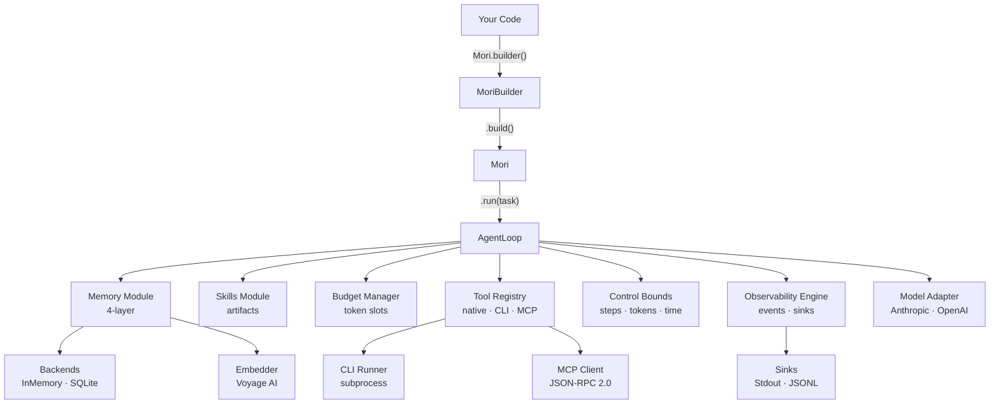

## Modules

| Module | What it does | Page |
|--------|-------------|------|
| [Runtime](architecture/runtime.md) | Async agent loop — plan → act → evaluate with memory + skill context | [→](architecture/runtime.md) |
| [Memory](architecture/memory.md) | Four-layer persistent memory (working / episodic / semantic / personalized) with vector retrieval | [→](architecture/memory.md) |
| [Skills](architecture/skills.md) | Filesystem-loaded task guides with progressive disclosure (abstract → summary → full) | [→](architecture/skills.md) |
| [Budget Manager](architecture/budget.md) | Per-slot context token tracking and 6-stage compaction pipeline | [→](architecture/budget.md) |
| [Observability](architecture/observability.md) | Structured event emission to pluggable sinks (stdout, JSONL) | [→](architecture/observability.md) |
| [Tools & Protocols](architecture/tools-and-protocols.md) | Native Python callables, CLI subprocess tools, MCP server tools | [→](architecture/tools-and-protocols.md) |
| [Control](architecture/control.md) | Resource bounds (max steps, tokens, timeouts) and retry logic | [→](architecture/control.md) |
| [Model Adapters](architecture/model-adapters.md) | Provider-neutral LLM interface; Anthropic Claude adapter included | [→](architecture/model-adapters.md) |

## Quickstart

```python
import asyncio
from mori import Mori

async def main():
    agent = (
        Mori.builder()
        .model("anthropic", model="claude-sonnet-4-20250514")
        .tool(lambda city: f"{city}: 72°F", description="Get weather", name="get_weather")
        .memory_backend("inmemory")
        .skill_registry("./skills")
        .sink("stdout")
        .budget(total_context_tokens=200_000)
        .build()
    )
    result = await agent.run("What's the weather in Paris?")
    print(result.final_output)
    await agent.close()

asyncio.run(main())
```

## Version History

| Version | Codename | What it added |
|---------|----------|---------------|
| [v0.1](history/v01-it-runs.md) | It Runs | Foundation — types, loop, tool registry, Anthropic adapter |
| [v0.2](history/v02-it-sees.md) | It Sees | Observability, control bounds, CLI tools, MCP protocol |
| [v0.3](history/v03-it-remembers.md) | It Remembers | Four-layer memory, retrieval pipeline, SQLite backend |
| [v0.4](history/v04-it-learns.md) | It Learns | Skills module, budget manager, 6-stage compaction |
| [v0.5](history/v05-its-governed.md) | It's Governed | Permission engine, checkpoints, lifecycle hooks *(in progress)* |
| [V1 Roadmap](history/v1-roadmap.md) | — | Full spec coverage: compliance, plugins, integration patterns |
```

- [ ] **Step 2: Verify build**

```bash
mkdocs build --strict --no-directory-urls 2>&1 | grep -E "WARNING|ERROR|built in"
```

Expected: warnings about other missing files (OK), no errors on index.md itself. The line `INFO - Documentation built in Xs` should appear.

- [ ] **Step 3: Commit**

```bash
git add mori-docs/index.md
git commit -m "docs: add hub page (index.md)"
```

---

## Task 3: Architecture Overview Page

**Files:**
- Create: `mori-docs/architecture/index.md`

- [ ] **Step 1: Create mori-docs/architecture/index.md**

```markdown
# Architecture Overview

A map of all Mori modules, their dependencies, and the data flow through a complete agent run.

## Module Dependency Graph

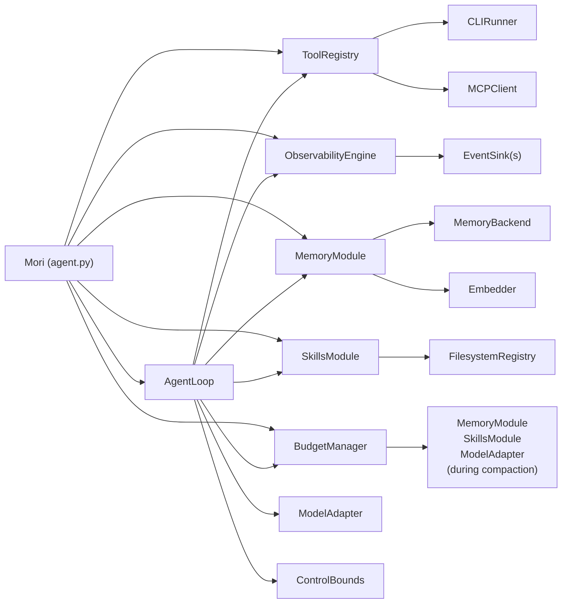

## Full Data Flow

A complete `Mori.run(task)` call traverses these phases in sequence for each loop step:

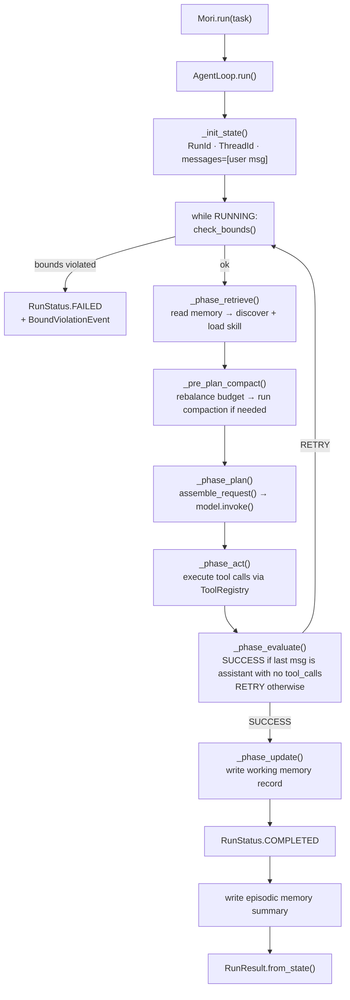

## Context Assembly

Before each model call, `_assemble_request()` builds the message list in this order
(index 0 = injected first, appears earliest in context):

```
index 0: [Skill Context]   ← active skill payload (inserted last, ends up first)
index 1: [Memory Context]  ← retrieved memory records (inserted first)
index 2: user message      ← the original task
index 3+: prior turns      ← assistant + tool messages from previous steps
```

## Builder Wiring

`MoriBuilder.build()` assembles all modules and wires them into a single `AgentLoop`:

```python
# Simplified build() — shows the wiring order
obs     = ObservabilityEngine(sinks)                    # 1. Observability
control = ControlBounds(ControlConfig(**config))        # 2. Control
registry = ToolRegistry()                               # 3. Tools
memory  = MemoryModule(backend, config, embedder)       # 4. Memory  (optional)
skills  = SkillsModule(FilesystemRegistry(path))        # 5. Skills  (optional)
budget  = BudgetManager(BudgetConfig(**budget_cfg))     # 6. Budget  (optional)
loop    = AgentLoop(model, registry, obs, control,      # 7. Loop — holds all modules
                    memory, skills, budget)
return Mori(loop, registry, obs, ...)
```

## Spec Index

| Spec | Title | Module page | Status |
|------|-------|-------------|--------|
| 00 | Overview | *(this page)* | ✅ |
| 01 | Core Types | [`mori/types.py`](../specs/01-CORE-TYPES.md) | ✅ |
| 02 | Runtime | [Runtime](runtime.md) | ✅ |
| 03 | Memory | [Memory](memory.md) | ✅ |
| 04 | Skills | [Skills](skills.md) | ✅ |
| 05 | Tools & Protocols | [Tools & Protocols](tools-and-protocols.md) | ✅ |
| 06 | Permission Engine | *(v0.5 — in progress)* | 🔄 |
| 07 | Control | [Control](control.md) | ✅ |
| 08 | Observability | [Observability](observability.md) | ✅ |
| 09 | Context Budget | [Budget Manager](budget.md) | ✅ |
| 10 | Plugins & Hooks | *(v0.5 — in progress)* | 🔄 |
| 11 | Integration | [V1 Roadmap](../history/v1-roadmap.md) | 📋 |
| 12 | AIUC-1 Compliance | [V1 Roadmap](../history/v1-roadmap.md) | 📋 |
| 13 | Pi Patterns | [V1 Roadmap](../history/v1-roadmap.md) | 📋 |
```

- [ ] **Step 2: Verify build**

```bash
mkdocs build --strict --no-directory-urls 2>&1 | grep -E "WARNING|ERROR|built in"
```

- [ ] **Step 3: Commit**

```bash
git add mori-docs/architecture/index.md
git commit -m "docs: add architecture overview page"
```

---

## Task 4: Runtime Module Page

**Files:**
- Create: `mori-docs/architecture/runtime.md`

- [ ] **Step 1: Create mori-docs/architecture/runtime.md**

```markdown
# Runtime

## TL;DR

`AgentLoop` is Mori's execution core — a 6-phase async loop that drives one agent "turn":
retrieve context → compact budget → invoke model → execute tools → evaluate outcome → persist
to memory. It runs until the model produces a final answer or a control bound is hit.

## Role in the System

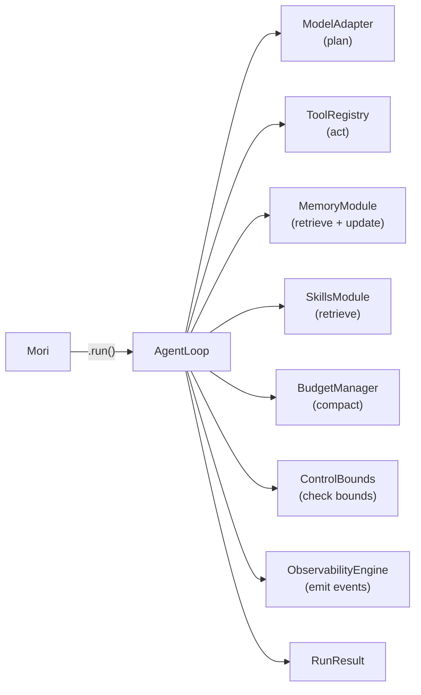

**Depends on:** `ModelAdapter`, `ToolRegistry`, `ControlBounds`, `ObservabilityEngine` (required);
`MemoryModule`, `SkillsModule`, `BudgetManager` (optional — all nil-safe).

**Called by:** `Mori.run()`.

## Key Concepts

- **`AgentLoop`** — The execution engine. Holds references to all modules; drives the phase sequence per step.
- **`MoriState`** — Mutable state carried across every step: message history, counters, memory slice, active skill payload.
- **`RunResult`** — Immutable summary returned to the caller: final output, total steps, token usage, duration.
- **`StepResult`** — Per-step summary (outcome, token usage, duration).
- **`Phase`** — Enum of 7 declared phases: `RETRIEVE`, `PLAN`, `VALIDATE`, `ACT`, `OBSERVE`, `EVALUATE`, `UPDATE`.
- **`RunStatus`** — Current lifecycle state: `PENDING` → `RUNNING` → `COMPLETED` / `FAILED` / `PAUSED` / `CANCELLED`.
- **`StepOutcome`** — Result of `_phase_evaluate`: `SUCCESS` (done), `RETRY` (keep looping), `ESCALATE`, `SKIP`.

## API Surface

```python
class AgentLoop:
    def __init__(
        self,
        model: ModelAdapter,
        tools: ToolRegistry,
        observability: ObservabilityEngine | None = None,
        control: ControlBounds | None = None,   # defaults to ControlConfig()
        memory: MemoryModule | None = None,
        skills: SkillsModule | None = None,
        budget: BudgetManager | None = None,
    ) -> None: ...

    async def run(
        self,
        task: str,
        thread_id: ThreadId | None = None,
        context: dict[str, Any] | None = None,
    ) -> RunResult: ...
```

```python
class MoriState(MoriModel):
    run_id: RunId
    thread_id: ThreadId
    task: str
    context: dict[str, Any]
    messages: list[Message]           # grows each step
    status: RunStatus
    memory_slice: MemorySlice | None  # set during _phase_retrieve
    active_skill_payload: Any | None  # set during _phase_retrieve
    step_count: int
    total_input_tokens: int
    total_output_tokens: int
    total_tool_calls: int
    started_at: datetime
    last_progress_at: datetime
```

```python
class RunResult(MoriModel):
    run_id: RunId
    thread_id: ThreadId
    status: RunStatus
    task: str
    final_output: str | None          # last assistant text message
    messages: list[Message]           # full conversation history
    total_steps: int
    total_usage: TokenUsage
    total_tool_calls: int
    total_duration_ms: float
    checkpoint_id: CheckpointId | None
```

## How It Works

### The Step Loop

Each iteration of `while state.status == RUNNING`:

1. **`check_bounds()`** — `ControlBounds.check_bounds(state)` validates step count, total tokens,
   run elapsed time, and idle elapsed time. Any violation sets `status = FAILED` immediately
   and emits a `BoundViolationEvent`.

2. **`_phase_retrieve(state)`** — If memory is configured: reads the most relevant records
   for the task (`MemoryModule.read()`), stores the result in `state.memory_slice`, charges
   the `MEMORY` budget slot. If skills are configured: discovers candidates
   (`SkillsModule.discover()`), loads the top match (`SkillsModule.load()` at `SUMMARY` level),
   stores it in `state.active_skill_payload`, charges the `SKILL` budget slot.

3. **`_pre_plan_compact(state)`** — If a budget is configured: rebalances slot allocations for
   the `PLAN` phase, then checks `needs_compaction()`. If over the 85% threshold, runs the
   6-stage compaction pipeline via `BudgetManager.compact()`.

4. **`_phase_plan(state)`** — Calls `_assemble_request(state)` to build the message list
   (with memory and skill injected as system messages), then calls `model.invoke(request)`.
   Appends the assistant response to `state.messages`.

5. **`_phase_act(state)`** — If the last message has tool calls, executes each via
   `ToolRegistry.invoke()`. Appends tool result messages to `state.messages`.

6. **`_phase_evaluate(state)`** — Returns `SUCCESS` if the last message is a plain assistant
   message (no tool calls). Returns `RETRY` otherwise.

7. **`_phase_update(state)`** — If memory is configured, writes a working-memory record
   summarizing the step.

### Post-Run Episodic Write

After the loop exits with `COMPLETED`, if memory is configured, a second write creates an
episodic memory record: the run summary (task, status, steps, tools used, final output excerpt).

### Context Assembly

`_assemble_request()` injects context at the front of the message list:

```python
messages = list(state.messages)
# Memory inserted first (goes to index 0)
if state.memory_slice and state.memory_slice.records:
    messages.insert(0, Message(role="system", content="[Memory Context]\n..."))
# Skill inserted second (pushes memory to index 1, skill is at index 0)
if state.active_skill_payload:
    messages.insert(0, Message(role="system", content="[Skill Context] ..."))
```

Result: skill context is always closest to the model's attention window.

??? note "Schema deferral during compaction"
    After `BudgetManager._stage_schema_defer()` fires, `_assemble_request()` sends only
    empty `input_schema: {}` for tools that weren't used in the last 6 messages. This
    can reclaim thousands of tokens when many tools are registered but few are actively used.

## Annotated Example

```python
import asyncio
from mori import Mori

async def main():
    agent = (
        Mori.builder()
        .model("anthropic")
        .tool(lambda city: f"{city}: 72°F", description="Get weather", name="get_weather")
        .sink("stdout")
        .build()
    )

    result = await agent.run("What's the weather in Paris?")
    # Step 1: model calls get_weather(city="Paris")
    # Step 2: tool returns "Paris: 72°F", model says "The weather in Paris is 72°F."
    # → StepOutcome.SUCCESS → RunStatus.COMPLETED

    print(result.final_output)       # "The weather in Paris is 72°F."
    print(result.total_steps)        # 2
    print(result.total_tool_calls)   # 1
    await agent.close()

asyncio.run(main())
```

> **Raw spec:** [`mori-docs/specs/02-RUNTIME.md`](../specs/02-RUNTIME.md)
```

- [ ] **Step 2: Verify build**

```bash
mkdocs build --strict --no-directory-urls 2>&1 | grep -E "WARNING|ERROR|built in"
```

- [ ] **Step 3: Commit**

```bash
git add mori-docs/architecture/runtime.md
git commit -m "docs: add runtime architecture page"
```

---

## Task 5: Memory Module Page

**Files:**
- Create: `mori-docs/architecture/memory.md`

- [ ] **Step 1: Create mori-docs/architecture/memory.md**

```markdown
# Memory

## TL;DR

`MemoryModule` gives the agent persistent context across steps and runs. It organizes records
into four layers with different semantics, retrieves the most relevant ones via a 4-stage
pipeline blending semantic similarity with recency, and writes new observations back after
each step.

## Role in the System

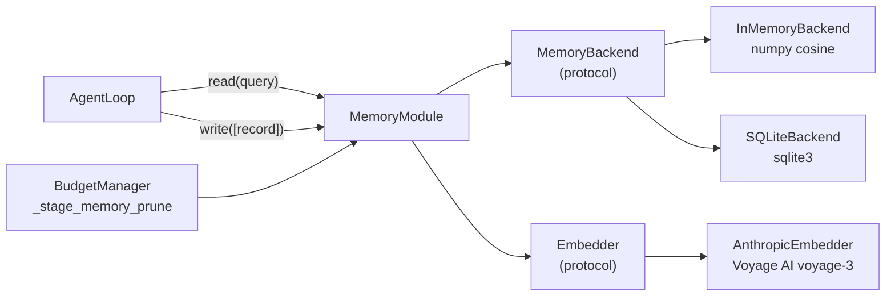

**Depends on:** `MemoryBackend` (required); `Embedder` (optional — without it, semantic search
is disabled and `read()` returns an empty slice).

**Called by:** `AgentLoop._phase_retrieve()`, `AgentLoop._phase_update()`,
`BudgetManager._stage_memory_prune()`.

## Key Concepts

- **`MemoryLayer`** — Four layers: `WORKING` (session scratch, 1-hour TTL), `EPISODIC`
  (run history, no TTL), `SEMANTIC` (extracted facts, no TTL), `PERSONALIZED` (user
  preferences, no TTL).
- **`MemoryRecord`** — One memory unit: content string, layer, confidence (0–1), embedding
  vector, provenance tag, optional TTL.
- **`MemorySlice`** — Result of `read()`: a ranked list of records within a token budget, plus
  `total_tokens`, `truncated`, and `conflicts` metadata.
- **`MemoryBackend`** — Protocol any storage implementation must satisfy: insert, get, update,
  delete, search (vector), list_records, count, close.
- **`Embedder`** — Protocol for generating vector embeddings. `AnthropicEmbedder` uses Voyage
  AI's `voyage-3` model (1024 dimensions).
- **`ForgetPolicy`** — Pruning rules: expire TTL-expired records, prune below a confidence
  threshold, deduplicate near-identical vectors.
- **`WriteReceipt`** — Returned from `write()`: created record IDs, layer, timestamp.

## API Surface

```python
class MemoryModule:
    async def read(
        self,
        query: str,
        layers: list[MemoryLayer] | None = None,  # None = all 4 layers
        max_tokens: int = 2000,
        recency_bias: float = 0.3,
        filters: MemoryFilters | None = None,
        task_context: str = "",
    ) -> MemorySlice: ...

    async def write(self, records: list[MemoryRecord]) -> WriteReceipt: ...
    async def update(self, record_id: MemoryRecordId, content: str | None = None,
                     metadata: dict | None = None,
                     confidence: float | None = None) -> MemoryRecord: ...
    async def delete(self, record_ids: list[MemoryRecordId]) -> int: ...
    async def promote(self, source_layer: MemoryLayer, target_layer: MemoryLayer,
                      record_ids: list[MemoryRecordId],
                      abstraction_fn: Callable | None = None) -> list[MemoryRecordId]: ...
    async def forget(self, policy: ForgetPolicy | None = None) -> ForgetReport: ...
    async def stats(self) -> MemoryStats: ...
    async def close(self) -> None: ...
```

```python
@runtime_checkable
class MemoryBackend(Protocol):
    async def insert(self, records: list[MemoryRecord]) -> list[MemoryRecordId]: ...
    async def search(self, embedding: list[float], layer: MemoryLayer | None = None,
                     limit: int = 20, filters: MemoryFilters | None = None
                     ) -> list[tuple[MemoryRecord, float]]: ...
    async def list_records(self, layer: MemoryLayer, limit: int = 100,
                           order_by: Literal["created_at","updated_at","confidence"] = "created_at"
                           ) -> list[MemoryRecord]: ...
    async def count(self, layer: MemoryLayer | None = None) -> int: ...
    async def close(self) -> None: ...
```

## How It Works

### The Four Layers

| Layer | Purpose | Default TTL | Default max records |
|-------|---------|-------------|---------------------|
| `WORKING` | Per-session scratch: tool results, intermediate reasoning | 3600s | 200 |
| `EPISODIC` | Run history: what happened, what tools were used, outcomes | None | 10,000 |
| `SEMANTIC` | Extracted facts and domain knowledge | None | 50,000 |
| `PERSONALIZED` | User preferences and behavioral patterns | None | 5,000 |

### Retrieval Pipeline

`retrieve()` in `mori/memory/retrieval.py` runs five stages:

**Stage 1 — Query Expansion**
```python
expanded = f"{query} {task_context}".strip()
```

**Stage 2 — Multi-Layer Fan-Out**
```python
embeddings = await embedder.embed([expanded])
for layer in search_layers:
    results = await backend.search(embedding=embeddings[0], layer=layer, limit=20)
    all_results.extend(results)
```

**Stage 3 — Relevance Scoring**
```python
# recency_score decays exponentially with a 1-day half-life
recency_score = exp(-age_seconds / 86400.0)
composite = (1.0 - recency_bias) * cosine_sim + recency_bias * recency_score
# Default: 70% semantic relevance, 30% recency
```

**Stage 4 — Budget-Aware Truncation**
```python
for record, _ in sorted(scored, key=score, reverse=True):
    tokens = len(record.content) // 4
    if total_tokens + tokens > max_tokens and selected:
        truncated = True; break
    selected.append(record)
    total_tokens += tokens
```

**Stage 5 — Conflict Detection** (stub — returns `conflicts=[]` currently)

??? note "Backend implementations"
    **`InMemoryBackend`** — dict-backed with numpy cosine similarity. Fast, no persistence.
    Good for tests and short-lived agents.

    **`SQLiteBackend`** — sqlite3-backed. Embeddings stored as BLOBs. Persists across process
    restarts. Good for development and single-instance production.

    To add a new backend, implement the 8-method `MemoryBackend` protocol — no inheritance
    required.

### Forget Lifecycle

`MemoryModule.forget(policy)` sweeps all layers:

- `expire_ttl=True` — deletes records where `(now - created_at).seconds > ttl_seconds`
- `prune_below_confidence=0.2` — deletes records with `confidence < 0.2`

The loop does **not** call `forget()` automatically — callers must schedule it (e.g., once
per hour for a long-running agent).

## Annotated Example

```python
import asyncio, secrets
from datetime import datetime, timezone
from mori import Mori
from mori.types import MemoryRecord, MemoryRecordId, MemoryLayer

async def main():
    agent = (
        Mori.builder()
        .model("anthropic")
        .memory_backend("sqlite", path="agent_memory.db")
        .build()
    )

    # Seed a semantic fact before running
    await agent.memory.write([
        MemoryRecord(
            record_id=MemoryRecordId(f"mem_{secrets.token_hex(8)}"),
            layer=MemoryLayer.SEMANTIC,
            content="Paris is the capital of France with a population of ~2.1M.",
            created_at=datetime.now(timezone.utc),
            updated_at=datetime.now(timezone.utc),
            confidence=0.95,
            provenance="manual_seed",
        )
    ])

    # _phase_retrieve will find this record and inject it as [Memory Context]
    result = await agent.run("What do you know about Paris?")
    print(result.final_output)
    await agent.close()

asyncio.run(main())
```

> **Raw spec:** [`mori-docs/specs/03-MEMORY.md`](../specs/03-MEMORY.md)
```

- [ ] **Step 2: Verify build**

```bash
mkdocs build --strict --no-directory-urls 2>&1 | grep -E "WARNING|ERROR|built in"
```

- [ ] **Step 3: Commit**

```bash
git add mori-docs/architecture/memory.md
git commit -m "docs: add memory architecture page"
```

---

## Task 6: Skills Module Page

**Files:**
- Create: `mori-docs/architecture/skills.md`

- [ ] **Step 1: Create mori-docs/architecture/skills.md**

```markdown
# Skills

## TL;DR

`SkillsModule` loads task-specific guidance into the agent's context at runtime. Skills live
as YAML + Markdown files on the filesystem. When a task matches, the skill's content is
injected as a system message — at three levels of detail (abstract, summary, full) to manage
token cost.

## Role in the System

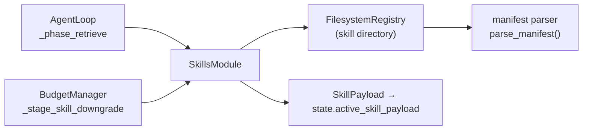

**Depends on:** `FilesystemRegistry` (required); `Embedder` (optional — without it, discovery
returns skills in directory order with uniform scores).

**Called by:** `AgentLoop._phase_retrieve()`, `BudgetManager._stage_skill_downgrade()`.

## Key Concepts

- **`SkillManifest`** — Parsed `manifest.yaml`: name, version, description, capabilities,
  preconditions (tools required, min context tokens), progressive disclosure content.
- **`DisclosureLevel`** — `ABSTRACT` (<100 chars), `SUMMARY` (<500 tokens), `FULL`
  (complete SKILL.md). The loop always loads at `SUMMARY`; compaction can downgrade `FULL`.
- **`SkillCandidate`** — A manifest + compatibility report + relevance score from `discover()`.
- **`CompatibilityReport`** — Whether the skill's required tools are available and whether
  there's enough context budget.
- **`SkillPayload`** — Loaded content at a given disclosure level: `skill_id`,
  `disclosure_level`, `content`, `token_estimate`.
- **`BoundSkill`** — A payload with its required tools resolved to live `ToolSpec` objects.
- **`FilesystemRegistry`** — Scans a root directory for skill subdirectories, lazy-loads
  and caches manifests.

## API Surface

```python
class SkillsModule:
    def discover(
        self,
        task: str,
        available_tools: list[str],
        available_tokens: int = 999_999,
        max_candidates: int = 5,
    ) -> list[SkillCandidate]: ...

    async def load(
        self, skill_id: str, disclosure_level: str, max_tokens: int
    ) -> SkillPayload: ...

    def bind(self, payload: SkillPayload, available_tools: list[ToolSpec]) -> BoundSkill: ...
    def record_outcome(self, skill_id: str, outcome: SkillExecutionOutcome) -> None: ...
    def health(self, skill_id: str) -> SkillHealthReport: ...
```

### manifest.yaml schema

```yaml
name: bug-fix               # alphanumeric/hyphen/underscore, required
version: 1.0.0              # semver (X.Y.Z), required
description: "..."          # human-readable, required
capabilities: [debugging, test-repair]
scope:
  domains: [code, testing]
preconditions:
  tools_required: [file-reader, test-runner]  # must be in ToolRegistry
  min_context_tokens: 500
constraints:
  max_files: 10
triggers:
  semantic: ["fix failing test", "debug", "broken"]
progressive_disclosure:
  abstract: "Fix a failing test by isolating and patching the root cause."  # <100 chars
  summary: "Read the failing test... [<500 tokens of prose]"
  full: SKILL.md   # pointer to full content file
```

## How It Works

### Discovery

`discover()` calls `registry.search(task, limit=50)`, then for each manifest:

1. **Compatibility check** — verifies all `tools_required` are in `available_tools` AND
   `available_tokens >= min_context_tokens`. Incompatible skills are filtered out entirely.
2. **Scoring** — currently `1.0` for all candidates when no embedder is present (registry
   order preserved). With an embedder: cosine similarity against semantic trigger embeddings.
3. Returns sorted candidates up to `max_candidates`.

The loop takes `candidates[0]` only if `compatibility_report.context_fits` is True.

### Progressive Disclosure

| Level | Source | Typical cost |
|-------|--------|-------------|
| `ABSTRACT` | `manifest.yaml → progressive_disclosure.abstract` | ~10–25 tokens |
| `SUMMARY` | `manifest.yaml → progressive_disclosure.summary` | ~50–500 tokens |
| `FULL` | `SKILL.md` (entire file, truncated to budget) | hundreds–thousands |

The loop always loads at `SUMMARY`. If compaction triggers `_stage_skill_downgrade`, a `FULL`
payload is replaced with `SUMMARY`, reclaiming tokens without losing guidance entirely.

### Skill Injection

The loaded `SkillPayload` is stored in `state.active_skill_payload`. In
`_assemble_request()`, it becomes the first system message:

```
[Skill Context] (bug-fix)
Read the failing test to understand expected behaviour. Run it to capture
the error. Read the source under test...
```

### Skill Health Tracking

`record_outcome()` appends a `SkillExecutionOutcome` to a per-skill deque (max 50). `health()`
computes success rate, avg steps, common failure reasons, and staleness (>90 days unused)
from the window.

## Annotated Example

```python
# skills/ layout:
# skills/code-review/manifest.yaml
# skills/code-review/SKILL.md

import asyncio
from mori import Mori

async def main():
    agent = (
        Mori.builder()
        .model("anthropic")
        .skill_registry("./skills")           # point at skills directory
        .budget(total_context_tokens=200_000)
        .build()
    )

    # _phase_retrieve calls skills.discover("Review this Python function...")
    # → finds code-review skill (tools_required=[], context fits)
    # → loads at SUMMARY level, injects as first system message
    result = await agent.run("Review this Python function: def add(a,b): return a-b")
    print(result.final_output)
    await agent.close()

asyncio.run(main())
```

> **Raw spec:** [`mori-docs/specs/04-SKILLS.md`](../specs/04-SKILLS.md)
```

- [ ] **Step 2: Verify build**

```bash
mkdocs build --strict --no-directory-urls 2>&1 | grep -E "WARNING|ERROR|built in"
```

- [ ] **Step 3: Commit**

```bash
git add mori-docs/architecture/skills.md
git commit -m "docs: add skills architecture page"
```

---

## Task 7: Budget Manager Page

**Files:**
- Create: `mori-docs/architecture/budget.md`

- [ ] **Step 1: Create mori-docs/architecture/budget.md**

```markdown
# Budget Manager

## TL;DR

`BudgetManager` tracks how many context tokens each part of the conversation consumes across
six named slots. When total consumption nears the model's context limit (85% by default), it
runs a 6-stage compaction pipeline to reclaim tokens — ordered from cheapest to most
aggressive.

## Role in the System

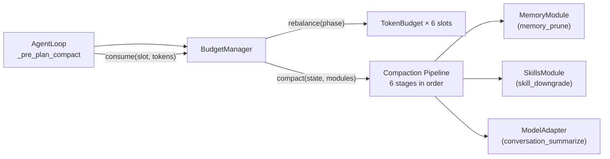

**Depends on:** nothing at construction; `MemoryModule`, `SkillsModule`, `ModelAdapter`
injected as `CompactionModules` only during `compact()`.

**Called by:** `AgentLoop._pre_plan_compact()`, `AgentLoop._phase_retrieve()` (slot
allocation checks).

## Key Concepts

- **`BudgetSlot`** — Six named slots: `SYSTEM_PROMPT`, `MEMORY`, `SKILL`, `TOOL_SCHEMAS`,
  `CONVERSATION`, `GENERATION`.
- **`TokenBudget`** — Per-slot: `allocated`, `consumed`, `remaining = allocated - consumed`.
- **`BudgetConfig`** — `total_context_tokens` (200k), `compaction_threshold_pct` (0.85),
  `min_generation_tokens` (1000), `max_result_tokens` (4000), `slot_overrides`.
- **`CompactionStage`** — The 6 stages: `RESULT_TRIM`, `SCHEMA_DEFER`, `TURN_SNIP`,
  `SKILL_DOWNGRADE`, `MEMORY_PRUNE`, `CONVERSATION_SUMMARIZE`.
- **`CompactionReport`** — Output of `compact()`: per-stage tokens reclaimed, total reclaimed,
  initial and final utilization.

## API Surface

```python
class BudgetManager:
    def get_allocation(self, slot: BudgetSlot) -> TokenBudget: ...
    def consume(self, slot: BudgetSlot, tokens: int) -> ConsumeResult: ...
    def release(self, slot: BudgetSlot, tokens: int) -> None: ...
    def rebalance(self, phase: Phase,
                  hints: RebalanceHints | None = None) -> dict[BudgetSlot, TokenBudget]: ...
    def needs_compaction(self) -> bool: ...
    def assemble_budget_report(self) -> BudgetReport: ...
    async def compact(self, state: MoriState,
                      modules: CompactionModules) -> CompactionReport: ...
```

## How It Works

### Slot Allocations

Default fractional allocation of `total_context_tokens`:

| Slot | Default | PLAN phase | ACT phase |
|------|---------|------------|-----------|
| `SYSTEM_PROMPT` | 10% | 10% | 10% |
| `MEMORY` | 20% | **25%** | **15%** |
| `SKILL` | 15% | **10%** | **20%** |
| `TOOL_SCHEMAS` | 10% | 10% | **15%** |
| `CONVERSATION` | 30% | 30% | 30% |
| `GENERATION` | 15% | 15% | 15% |

`rebalance(phase)` recalculates each step. Fractions are normalized to sum to 1.0 after
overrides are applied. `GENERATION` is always guaranteed at least `min_generation_tokens`.

### Compaction Pipeline

When `needs_compaction()` is True (consumed > 85% of total), `compact()` runs stages in
order. Each stage fires only if the agent is still over budget — stages are skipped once
back under threshold.

| Stage | What it does | Aggressiveness |
|-------|-------------|----------------|
| `RESULT_TRIM` | Truncates tool result messages to `max_result_tokens` | Minimal |
| `SCHEMA_DEFER` | Sends empty `input_schema: {}` for unused tools | Low |
| `TURN_SNIP` | Removes one oldest tool-call + result round | Medium |
| `SKILL_DOWNGRADE` | Downgrades active skill `FULL` → `SUMMARY` | Medium |
| `MEMORY_PRUNE` | Re-reads memory at half the current token budget | High |
| `CONVERSATION_SUMMARIZE` | Replaces middle messages with a model-generated summary | Highest |

??? note "Why this order?"
    The pipeline is conservative by design. `RESULT_TRIM` reclaims tokens that are already
    fully received (output is done, truncation loses nothing new). `SCHEMA_DEFER` sends less
    data to the model without changing conversation state. Only if those aren't enough does
    the pipeline touch conversation history — and only `CONVERSATION_SUMMARIZE` makes a
    model call, which has latency and cost.

## Annotated Example

```python
from mori import Mori

agent = (
    Mori.builder()
    .model("anthropic")
    .budget(
        total_context_tokens=200_000,
        compaction_threshold_pct=0.85,   # compact when 85% full
        min_generation_tokens=1000,       # always reserve 1k tokens for output
        max_result_tokens=4000,           # trim tool results to 4k tokens
        slot_overrides={                  # override default fractions
            "memory": 0.25,              # give memory more space
            "skill": 0.10,
        },
    )
    .build()
)
```

> **Raw spec:** [`mori-docs/specs/09-CONTEXT-BUDGET.md`](../specs/09-CONTEXT-BUDGET.md)
```

- [ ] **Step 2: Verify build**

```bash
mkdocs build --strict --no-directory-urls 2>&1 | grep -E "WARNING|ERROR|built in"
```

- [ ] **Step 3: Commit**

```bash
git add mori-docs/architecture/budget.md
git commit -m "docs: add budget manager architecture page"
```

---

## Task 8: Observability Page

**Files:**
- Create: `mori-docs/architecture/observability.md`

- [ ] **Step 1: Create mori-docs/architecture/observability.md**

```markdown
# Observability

## TL;DR

`ObservabilityEngine` captures every meaningful event in an agent run and dispatches them to
pluggable sinks. Sinks can be real-time (stdout) or batched (JSONL). All 13 event types are
structured Pydantic models, fully serializable to JSON.

## Role in the System

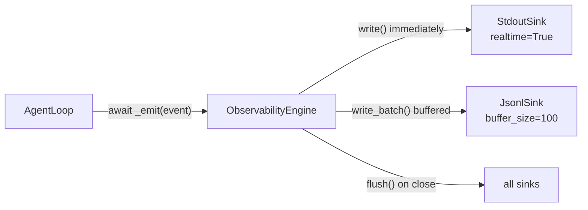

**Depends on:** `EventSink` implementations (none required — engine is nil-safe).

**Called by:** `AgentLoop` at 13+ points per run.

## Key Concepts

- **`MoriEvent`** — Base class: `event_id`, `event_type`, `timestamp`, `run_id`, optional
  `step_id`, `trace_id`, `span_id`, `risk_flags`, `metadata`.
- **`EventSink`** — Protocol: `write(event)`, `write_batch(events)`, `flush()`, `close()`.
- **`ObservabilityConfig`** — Controls buffer size (100), flush interval (5s), what to
  include, max content length, enabled event type filter.
- **`SpanContext`** — Trace span: `trace_id`, `span_id`, `parent_span_id`, `name`,
  `start_time`, `end_time`, `duration_ms` (computed property).
- **`RunSummary`** — Aggregated view post-run: steps, tokens, tool calls/failures, tools used,
  errors.

## API Surface

```python
class ObservabilityEngine:
    async def emit(self, event: MoriEvent) -> None: ...
    async def emit_batch(self, events: list[MoriEvent]) -> None: ...
    def start_trace(self, run_id: RunId) -> TraceId: ...
    def start_span(self, trace_id: TraceId, name: str,
                   parent_span_id: str | None = None) -> SpanContext: ...
    def end_span(self, span: SpanContext) -> None: ...
    def get_run_summary(self, run_id: RunId) -> RunSummary: ...
    async def flush(self) -> None: ...
    async def close(self) -> None: ...

@runtime_checkable
class EventSink(Protocol):
    async def write(self, event: MoriEvent) -> None: ...
    async def write_batch(self, events: list[MoriEvent]) -> None: ...
    async def flush(self) -> None: ...
    async def close(self) -> None: ...
```

## How It Works

### Event Taxonomy

| Event type | Class | Emitted when |
|------------|-------|-------------|
| `run.start` | `RunStartEvent` | `AgentLoop.run()` begins |
| `run.end` | `RunEndEvent` | `AgentLoop.run()` exits |
| `step.start` | `StepStartEvent` | Each step iteration begins |
| `step.end` | `StepEndEvent` | Each step iteration ends |
| `tool.invoke` | `ToolInvokeEvent` | Before each tool call |
| `tool.result` | `ToolResultEvent` | After each tool call |
| `control.bound_violation` | `BoundViolationEvent` | A resource bound is exceeded |
| `memory.read` | `MemoryReadEvent` | After `MemoryModule.read()` |
| `memory.write` | `MemoryWriteEvent` | After `MemoryModule.write()` |
| `skill.discover` | `SkillDiscoverEvent` | After `SkillsModule.discover()` |
| `skill.load` | `SkillLoadEvent` | After `SkillsModule.load()` |
| `budget.rebalance` | `BudgetRebalanceEvent` | After `BudgetManager.rebalance()` |
| `budget.compaction` | `CompactionEvent` | After `BudgetManager.compact()` |

### Buffering Strategy

`ObservabilityEngine` checks the `realtime` attribute on each sink:

- **`StdoutSink`** — `realtime = True`: `write()` is called immediately on every `emit()`.
  Events appear as they fire (interactive feedback).
- **`JsonlSink`** — no `realtime`: events accumulate in `_buffer`. Buffer flushes when it
  reaches `buffer_size` (100 events) or when `flush()`/`close()` is called (efficient I/O).

??? note "Adding a custom sink"
    Implement the 4-method `EventSink` protocol. For custom sinks, construct
    `ObservabilityEngine([your_sink], ObservabilityConfig())` directly and pass it to
    `AgentLoop`. The builder's `.sink()` method only accepts `"stdout"` and `"jsonl"` by name.

## Annotated Example

```python
import asyncio
from mori import Mori

async def main():
    agent = (
        Mori.builder()
        .model("anthropic")
        .sink("stdout")                       # real-time console output
        .sink("jsonl", path="traces.jsonl")   # buffered JSONL traces
        .build()
    )
    result = await agent.run("Hello, Mori!")

    # Get a summary of this run from the engine
    summary = agent._obs.get_run_summary(result.run_id)
    print(f"Steps: {summary.total_steps}")
    print(f"Tokens: {summary.total_input_tokens + summary.total_output_tokens}")
    await agent.close()   # flushes and closes all sinks

asyncio.run(main())
```

> **Raw spec:** [`mori-docs/specs/08-OBSERVABILITY.md`](../specs/08-OBSERVABILITY.md)
```

- [ ] **Step 2: Verify build**

```bash
mkdocs build --strict --no-directory-urls 2>&1 | grep -E "WARNING|ERROR|built in"
```

- [ ] **Step 3: Commit**

```bash
git add mori-docs/architecture/observability.md
git commit -m "docs: add observability architecture page"
```

---

## Task 9: Tools & Protocols Page

**Files:**
- Create: `mori-docs/architecture/tools-and-protocols.md`

- [ ] **Step 1: Create mori-docs/architecture/tools-and-protocols.md**

```markdown
# Tools & Protocols

## TL;DR

`ToolRegistry` is the single source of truth for all tools available to an agent. It manages
three kinds of tools — native Python callables, CLI subprocess wrappers, and MCP server tools
— behind a unified `invoke()` interface. It also tracks per-tool call metrics.

## Role in the System

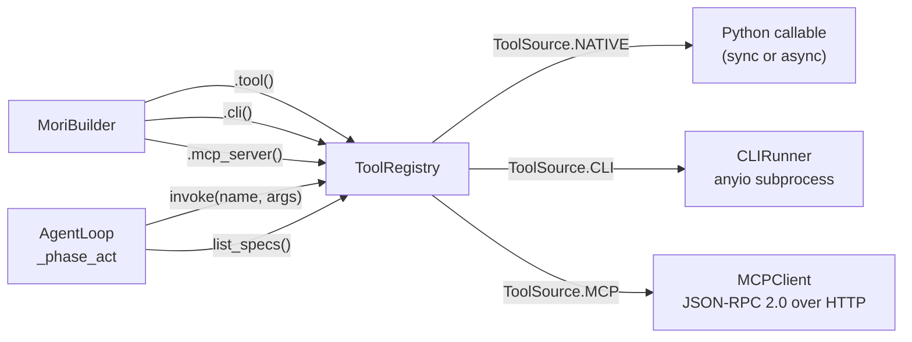

**Depends on:** `CLIRunner` (CLI tools), `MCPClient` (MCP tools), `infer_schema()` (auto
schema generation).

**Called by:** `AgentLoop._phase_act()` (invoke), `AgentLoop._assemble_request()` (list_specs).

## Key Concepts

- **`ToolSpec`** — The model's view of a tool: `tool_id`, `name`, `description`,
  `input_schema` (JSON Schema), `source`, optional `server_id`, `tags`.
- **`RegisteredTool`** — Internal entry: `ToolSpec` + optional Python callable `fn`.
- **`ToolSource`** — Enum: `NATIVE`, `CLI`, `MCP`, `A2A`, `OPENAPI`.
- **`ToolResult`** — Invocation result: `tool_name`, `call_id`, `success`, `content`,
  `error`, `latency_ms`, `metadata`.
- **`ToolMetrics`** — Per-tool counters: `total_calls`, `total_errors`, `avg_latency_ms`,
  `error_rate`, `last_called`.
- **`CLIRunner`** — Async subprocess via `anyio.run_process()`. Timeout via
  `anyio.fail_after()`. Captures stdout + stderr.
- **`MCPClient`** — JSON-RPC 2.0 over HTTP/SSE. `tools/list` to discover, `tools/call`
  to invoke. `SchemaCache` caches tool schemas with TTL.
- **`infer_schema()`** — Introspects Python function type annotations to generate JSON Schema.

## API Surface

```python
class ToolRegistry:
    def register(self, name: str, fn: Callable, description: str,
                 input_schema: dict | None = None,
                 tags: list[str] | None = None) -> str: ...         # returns tool_id

    def tool(self, description: str, name: str | None = None,
             tags: list[str] | None = None) -> Callable: ...         # decorator

    def register_cli(self, name: str, command: str, description: str,
                     args_format: str = "flags", args_schema: dict | None = None,
                     shell: bool = False, cwd: str | None = None,
                     env: dict[str,str] | None = None,
                     timeout_sec: float = 60.0,
                     tags: list[str] | None = None) -> str: ...

    async def register_mcp_server(self, name: str, url: str,
                                   transport: str = "sse",
                                   auth: Any = None) -> list[str]: ...

    async def invoke(self, name: str, arguments: dict[str, Any]) -> ToolResult: ...
    def list_specs(self) -> list[ToolSpec]: ...
    def get_spec(self, name: str) -> ToolSpec | None: ...
    def get_metrics(self, tool_id: str) -> ToolMetrics | None: ...
```

## How It Works

### Invocation Routing

`invoke()` routes by `ToolSource`:

```python
if source == ToolSource.CLI:
    result = await runner.run(arguments, config)          # anyio subprocess
elif source == ToolSource.MCP:
    result = await mcp_clients[server_id].invoke(name, arguments)  # HTTP JSON-RPC
elif fn is not None:                                       # NATIVE
    if asyncio.iscoroutinefunction(fn):
        raw = await fn(**arguments)
    else:
        raw = fn(**arguments)                             # sync fn — no thread pool
```

All successful results are truncated to `max_result_tokens` (default 4000) using a
`chars = tokens × 4` heuristic, with a `[TRUNCATED — original length: N chars]` suffix.

### CLI Argument Formats

`CLIRunner` supports 4 modes (in `mori/protocols/cli/args.py`):

| Format | Input dict | Shell args produced |
|--------|-----------|-------------------|
| `flags` | `{"verbose": True, "output": "file.txt"}` | `--verbose --output file.txt` |
| `positional` | `{"path": "/tmp", "name": "foo"}` | `/tmp foo` |
| `subcommand` | `{"subcommand": "list", "filter": "active"}` | `list --filter active` |
| `raw` | `{"args": "--foo bar"}` | `--foo bar` (passed as-is) |

### Schema Inference

`infer_schema(fn)` uses `inspect.signature` to build JSON Schema from type annotations:

```python
def search(query: str, limit: int = 10) -> list[str]: ...
# Produces:
# {
#   "type": "object",
#   "properties": {"query": {"type": "string"}, "limit": {"type": "integer"}},
#   "required": ["query"]   ← limit has a default, so not required
# }
```

`BaseModel` subclasses are inlined via `model_json_schema()`. Unannotated parameters default
to `{"type": "string"}`.

### MCP Tool IDs

MCP tools use IDs in format `mcp:{server_name}:{tool_name}`. The `server_id` field on
`ToolSpec` stores the server name; `invoke()` uses it to route to the correct `MCPClient`.

## Annotated Example

```python
import asyncio
from mori import Mori

async def main():
    agent = (
        Mori.builder()
        .model("anthropic")
        # Native tool — schema auto-inferred from type hints
        .tool(lambda query: f"Results for: {query}", description="Search docs", name="search")
        # CLI tool — runs 'git log' as subprocess
        .cli("git_log", command="git", description="Show recent commits",
             args_format="subcommand",
             args_schema={"type": "object", "properties": {
                 "subcommand": {"type": "string"},
                 "n": {"type": "integer"},
             }})
        .build()
    )
    result = await agent.run("Search for 'memory' and show the last 3 git commits")
    await agent.close()

asyncio.run(main())
```

> **Raw spec:** [`mori-docs/specs/05-TOOLS-AND-PROTOCOLS.md`](../specs/05-TOOLS-AND-PROTOCOLS.md)
```

- [ ] **Step 2: Verify build**

```bash
mkdocs build --strict --no-directory-urls 2>&1 | grep -E "WARNING|ERROR|built in"
```

- [ ] **Step 3: Commit**

```bash
git add mori-docs/architecture/tools-and-protocols.md
git commit -m "docs: add tools and protocols architecture page"
```

---

## Task 10: Control Page

**Files:**
- Create: `mori-docs/architecture/control.md`

- [ ] **Step 1: Create mori-docs/architecture/control.md**

```markdown
# Control

## TL;DR

`ControlBounds` is the single authority for all resource limits on an agent run. It checks
four bounds before every step and provides exponential backoff retry decisions for failed
tool calls.

## Role in the System

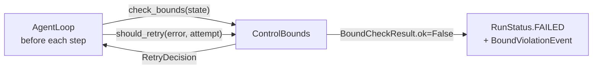

**Depends on:** `MoriState` (read-only for bounds checking).

**Called by:** `AgentLoop` — `check_bounds()` at the top of every loop iteration.

## Key Concepts

- **`ControlConfig`** — The 7 configurable limits.
- **`BoundCheckResult`** — `ok` (bool), `violated_bounds` (list of bound names),
  `current_values` (dict of measured values).
- **`RetryDecision`** — `should_retry` (bool), `wait_sec` (backoff), `attempt` (count).

## API Surface

```python
class ControlConfig(MoriModel):
    max_steps: int = 50                   # hard limit on loop iterations
    max_total_tokens: int = 2_000_000     # cumulative input + output tokens
    step_timeout_sec: float = 120.0       # per-step wall clock (not yet enforced)
    run_timeout_sec: float = 3600.0       # total run wall clock
    idle_timeout_sec: float = 300.0       # no progress recorded for this long
    max_retries_per_tool: int = 2         # tool call retry budget
    retry_backoff_base_sec: float = 1.0   # exponential backoff base

class ControlBounds:
    def check_bounds(self, state: MoriState) -> BoundCheckResult: ...
    def should_retry(self, error: Exception, attempt: int) -> RetryDecision: ...
    def record_progress(self) -> None: ...   # resets idle timer
```

## How It Works

### Bound Checks

`check_bounds()` evaluates all four bounds synchronously before each step:

1. `step_count >= max_steps` → violates `"max_steps"`
2. `total_input_tokens + total_output_tokens >= max_total_tokens` → violates `"max_total_tokens"`
3. `(now - state.started_at).seconds >= run_timeout_sec` → violates `"run_timeout"`
4. `(now - state.last_progress_at).seconds >= idle_timeout_sec` → violates `"idle_timeout"`

Any violation emits a `BoundViolationEvent` and sets `state.status = FAILED`. Multiple bounds
can fire simultaneously.

### Retry Logic

```python
wait = min(base_sec * (2 ** attempt), 60.0)
# attempt=0 → 1s, attempt=1 → 2s, attempt=2 → 4s, ..., capped at 60s
```

Returns `should_retry=False` once `attempt >= max_retries_per_tool`.

### Idle Timeout

The loop calls `record_progress()` after each `RETRY` step. If the agent gets stuck in a
loop making no forward progress (e.g., a tool keeps failing), `idle_elapsed >=
idle_timeout_sec` fires.

## Annotated Example

```python
from mori import Mori

agent = (
    Mori.builder()
    .model("anthropic")
    .config(
        max_steps=10,               # stop after 10 iterations
        run_timeout_sec=60.0,       # stop after 1 minute wall clock
        idle_timeout_sec=30.0,      # stop if no progress for 30s
        max_total_tokens=500_000,   # stop if tokens exceed 500k
    )
    .build()
)
```

> **Raw spec:** [`mori-docs/specs/07-CONTROL.md`](../specs/07-CONTROL.md)
```

- [ ] **Step 2: Verify build**

```bash
mkdocs build --strict --no-directory-urls 2>&1 | grep -E "WARNING|ERROR|built in"
```

- [ ] **Step 3: Commit**

```bash
git add mori-docs/architecture/control.md
git commit -m "docs: add control architecture page"
```

---

## Task 11: Model Adapters Page

**Files:**
- Create: `mori-docs/architecture/model-adapters.md`

- [ ] **Step 1: Create mori-docs/architecture/model-adapters.md**

```markdown
# Model Adapters

## TL;DR

`ModelAdapter` is the protocol all LLM provider integrations must implement. `AnthropicAdapter`
is the built-in implementation for Claude models via the Anthropic SDK. The adapter handles
message format conversion, system message extraction, and tool call parsing.

## Role in the System

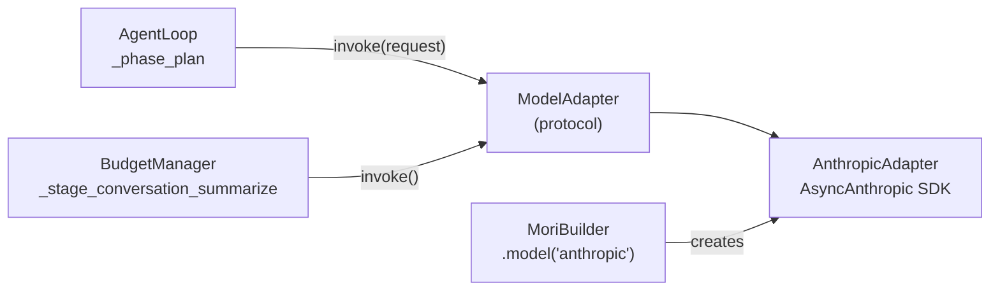

**Depends on:** `anthropic` SDK (optional import — raises `ImportError` with install
instructions if missing).

**Called by:** `AgentLoop._phase_plan()`, `BudgetManager._stage_conversation_summarize()`.

## Key Concepts

- **`ModelAdapter`** — A `@runtime_checkable Protocol` with 5 methods. Any object
  implementing these methods is a valid adapter.
- **`StreamChunk`** — Typed streaming delta: `type` (text_delta, tool_call_start, etc.),
  `text`, `tool_call`, `usage`.
- **`AnthropicAdapter`** — Wraps `anthropic.AsyncAnthropic`. Converts Mori message format
  to Anthropic's format and back.

## API Surface

```python
@runtime_checkable
class ModelAdapter(Protocol):
    async def invoke(self, request: ModelRequest) -> ModelResponse: ...
    async def stream(self, request: ModelRequest) -> AsyncIterator[StreamChunk]: ...
    async def count_tokens(self, text: str) -> int: ...

    @property
    def max_context_tokens(self) -> int: ...
    @property
    def model_id(self) -> str: ...
    @property
    def supports_tool_use(self) -> bool: ...
```

```python
class ModelRequest(MoriModel):
    messages: list[Message]
    tools: list[ToolSpec] | None = None
    max_tokens: int = 4096
    temperature: float = 0.0
    stop_sequences: list[str] | None = None
    metadata: dict[str, Any] = Field(default_factory=dict)

class ModelResponse(MoriModel):
    message: Message
    usage: TokenUsage
    stop_reason: Literal["end_turn", "tool_use", "max_tokens", "stop_sequence"]
    raw: dict[str, Any]
```

## How It Works

### Message Conversion

Anthropic's API requires alternating user/assistant roles and a separate `system` parameter.
`AnthropicAdapter` performs three transformations:

**1. System extraction** — `_extract_system()` collects all messages with `role="system"`,
concatenates their content, and passes it as Anthropic's `system=` parameter (removed from
the message list).

**2. Tool result merging** — Consecutive tool result messages must merge into a single user
message with a list of `tool_result` content blocks:

```python
# Mori internal format — two separate messages:
Message(role="tool", content="42",     tool_call_id="call_1")
Message(role="tool", content="Paris",  tool_call_id="call_2")

# Anthropic format — one user message with two blocks:
{"role": "user", "content": [
    {"type": "tool_result", "tool_use_id": "call_1", "content": "42"},
    {"type": "tool_result", "tool_use_id": "call_2", "content": "Paris"},
]}
```

**3. Tool call conversion** — Assistant messages with tool calls become mixed content blocks
(text block + tool_use blocks).

### Supported Models

| Model ID | Context window |
|----------|----------------|
| `claude-sonnet-4-20250514` | 200,000 tokens |
| `claude-opus-4-20250514` | 200,000 tokens |
| `claude-haiku-3-5-20241022` | 200,000 tokens |

All other model IDs fall back to 200,000 tokens.

### Current Limitations

- **`stream()`** raises `NotImplementedError` — streaming not implemented in current version.
- **`count_tokens()`** uses `len(text) // 4` heuristic, not the Anthropic token counting API.

## Annotated Example

```python
import asyncio

# Using the builder (recommended)
from mori import Mori
agent = Mori.builder().model("anthropic", model="claude-sonnet-4-20250514", max_tokens=8192).build()

# Using the adapter directly (for testing or custom loops)
from mori.model.anthropic import AnthropicAdapter
from mori.types import ModelRequest, Message

async def direct():
    adapter = AnthropicAdapter(model="claude-sonnet-4-20250514")
    response = await adapter.invoke(ModelRequest(
        messages=[Message(role="user", content="Hello")]
    ))
    print(response.message.content)    # "Hello! How can I help you?"
    print(response.usage.total)        # total tokens used
    print(response.stop_reason)        # "end_turn"

asyncio.run(direct())
```

> **Raw spec:** [`mori-docs/specs/02-RUNTIME.md`](../specs/02-RUNTIME.md) (Sections 10–12)
```

- [ ] **Step 2: Verify build**

```bash
mkdocs build --strict --no-directory-urls 2>&1 | grep -E "WARNING|ERROR|built in"
```

- [ ] **Step 3: Commit**

```bash
git add mori-docs/architecture/model-adapters.md
git commit -m "docs: add model adapters architecture page"
```

---

## Task 12: Version History Index

**Files:**
- Create: `mori-docs/history/index.md`

- [ ] **Step 1: Create mori-docs/history/index.md**

```markdown
# Version History

Mori is built in iterative versions, each adding a named capability layer. The codenames
describe what the agent gains with each version.

| Version | Codename | Released | What it gained | Key design decision |
|---------|----------|---------|---------------|-------------------|
| [v0.1](v01-it-runs.md) | **It Runs** | 2026-04-19 | Types · Loop · Tools · Anthropic adapter | Pydantic v2 for all types; async from day 1 |
| [v0.2](v02-it-sees.md) | **It Sees** | 2026-04-25 | Observability · Control · CLI · MCP | Real-time vs buffered sinks; ControlBounds extracted from loop |
| [v0.3](v03-it-remembers.md) | **It Remembers** | 2026-04-26 | 4-layer memory · Retrieval pipeline · SQLite | 4-stage retrieval; recency × relevance composite scoring |
| [v0.4](v04-it-learns.md) | **It Learns** | 2026-04-29 | Skills module · Budget manager · Compaction | Progressive disclosure; 6-stage ordered compaction |
| [v0.5](v05-its-governed.md) | **It's Governed** | *(in progress)* | Permissions · Checkpoints · Hooks | ESCALATE → PAUSE → resume flow |
| [V1 Roadmap](v1-roadmap.md) | — | *(planned)* | Compliance · Plugins · Integration · Pi patterns | Full governance layer |
```

- [ ] **Step 2: Verify build**

```bash
mkdocs build --strict --no-directory-urls 2>&1 | grep -E "WARNING|ERROR|built in"
```

- [ ] **Step 3: Commit**

```bash
git add mori-docs/history/index.md
git commit -m "docs: add version history index"
```

---

## Task 13: v0.1 History Page

**Files:**
- Create: `mori-docs/history/v01-it-runs.md`

- [ ] **Step 1: Create mori-docs/history/v01-it-runs.md**

```markdown
# v0.1 — "It Runs"

**Released:** 2026-04-19
**Specs added:** 01 (Core Types), 02 (Runtime), 05 (Tools — native only), 08 (Observability — stub)

## What Changed

- **`mori/types.py`** — the complete shared vocabulary: identifiers (`RunId`, `ToolId`, etc.),
  enums (`Phase`, `RunStatus`, `StepOutcome`), base models, message types, tool types,
  error hierarchy
- **`mori/runtime/`** — `AgentLoop` (plan → act → evaluate), `MoriState`, `RunResult`,
  `StepResult`
- **`mori/tools/`** — `ToolRegistry` (native Python callables only), `infer_schema()`
  (type annotation → JSON Schema)
- **`mori/model/`** — `ModelAdapter` protocol, `AnthropicAdapter` (full invoke + message
  conversion)
- **`mori/agent.py`** — `Mori` class, `MoriBuilder` fluent builder

## Why It Mattered

Before v0.1, there was nothing. The goal was the smallest possible working agent: given a
task, call Claude, execute any tool calls it requests, loop until done. Every subsequent
version builds on this foundation without breaking the builder API.

The decision to use **Pydantic v2 for all types** — not just for validation but as the
serialization layer — meant that every message, tool call, and result was JSON-serializable
from day one. This made observability (any event can be serialized) and testing (compare
models by value) natural to add later.

**Async-first** was the second foundation decision: the loop, tool invocations, and model
calls are all `async` even in v0.1. Synchronous tool functions are detected via
`asyncio.iscoroutinefunction` and called normally (no thread pool). This meant no rewrites
when MCP (requiring async HTTP) arrived in v0.2.

## Architecture at This Point

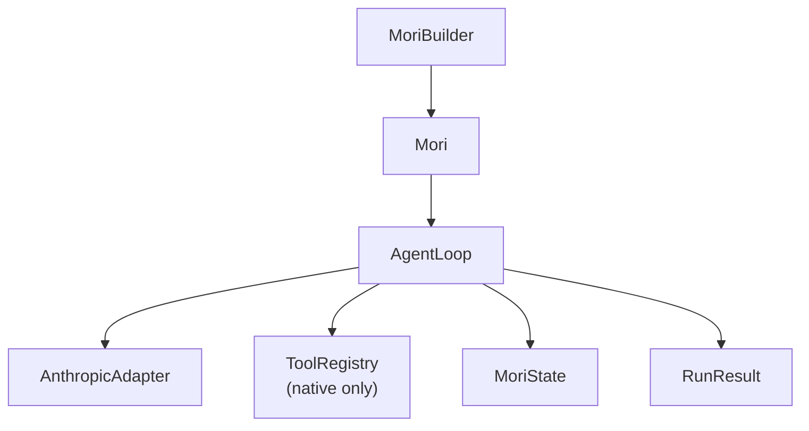

## Key Files Introduced

| File | Purpose |
|------|---------|
| `mori/types.py` | All shared types — the single source of truth |
| `mori/agent.py` | `Mori` + `MoriBuilder` — the public API |
| `mori/runtime/loop.py` | `AgentLoop` — plan/act/evaluate cycle |
| `mori/runtime/state.py` | `MoriState` — mutable run context |
| `mori/runtime/result.py` | `RunResult`, `StepResult` — immutable outputs |
| `mori/tools/registry.py` | `ToolRegistry` — native tool store + invoke |
| `mori/tools/schema.py` | `infer_schema()` — annotation → JSON Schema |
| `mori/model/base.py` | `ModelAdapter` protocol, `StreamChunk` |
| `mori/model/anthropic.py` | `AnthropicAdapter` — Claude via Anthropic SDK |

## Design Decisions Worth Noting

**Why not LangGraph for the loop?** Explicit choice to own the runtime. A framework adds
import overhead, opinionated abstractions, and version coupling. A 100-line async loop is
debuggable in 5 minutes.

**Why `NewType` for IDs?** `RunId`, `StepId`, `ToolId` are `NewType` wrappers over `str`.
At runtime they're plain strings, but mypy treats them as distinct types — so passing a
`ToolId` where a `RunId` is expected is a type error, not a silent bug.

**Why `model_config = {"frozen": False, "extra": "forbid"}` on `MoriModel`?** `extra =
"forbid"` catches field-name typos immediately at construction. `frozen = False` keeps
`MoriState` mutable across loop iterations. `ImmutableModel` (`frozen = True`) is used for
value objects like `TokenUsage` that should never change after creation.
```

- [ ] **Step 2: Verify build**

```bash
mkdocs build --strict --no-directory-urls 2>&1 | grep -E "WARNING|ERROR|built in"
```

- [ ] **Step 3: Commit**

```bash
git add mori-docs/history/v01-it-runs.md
git commit -m "docs: add v0.1 version history page"
```

---

## Task 14: v0.2 History Page

**Files:**
- Create: `mori-docs/history/v02-it-sees.md`

- [ ] **Step 1: Create mori-docs/history/v02-it-sees.md**

```markdown
# v0.2 — "It Sees"

**Released:** 2026-04-25
**Specs added:** 05 (CLI + MCP protocols), 07 (ControlBounds extracted), 08 (Observability
engine + sinks)

## What Changed

- **`mori/observability/`** — `ObservabilityEngine` (buffered dispatch), full 13-event
  taxonomy, `StdoutSink` (real-time), `JsonlSink` (buffered)
- **`mori/control/`** — `ControlBounds`, `ControlConfig` extracted from inline loop logic
- **`mori/protocols/cli/`** — `CLIRunner` (anyio subprocess), `CLIToolConfig`, 4 argument
  format modes
- **`mori/protocols/mcp/`** — `MCPClient` (JSON-RPC 2.0 over HTTP), `SchemaCache` with TTL
- **`mori/tools/registry.py`** — extended with `register_cli()`, `register_mcp_server()`,
  per-tool metrics, result truncation
- **`mori/agent.py`** — added `.cli()`, `.mcp_server()`, `.sink()` builder methods

## Why It Mattered

A running agent without observability is a black box. v0.2 made every significant event —
step boundaries, tool calls, bound violations — a structured, serializable object. The stdout
sink gave immediate human-readable feedback; the JSONL sink gave machine-readable traces.

`ControlBounds` was extracted from inline `if step > max_steps:` checks into a first-class
module — configurable, testable in isolation, and observable (violations emit events).

CLI tools and MCP server integration expanded the tool surface from "Python functions only"
to "anything with a command-line interface or an MCP endpoint."

## Architecture at This Point

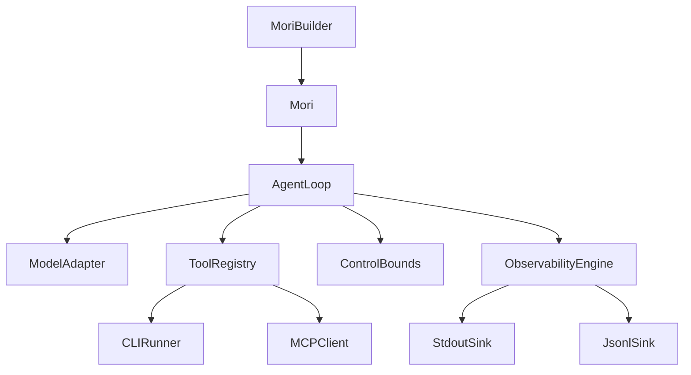

## Key Files Introduced

| File | Purpose |
|------|---------|
| `mori/observability/events.py` | Full event taxonomy + `EventSink` protocol + `ObservabilityConfig` |
| `mori/observability/engine.py` | Buffered dispatch, trace context, `get_run_summary()` |
| `mori/observability/sinks/stdout.py` | Color-formatted real-time console output |
| `mori/observability/sinks/jsonl.py` | Append-mode JSONL file writer |
| `mori/control/bounds.py` | `ControlBounds`, `ControlConfig`, `BoundCheckResult` |
| `mori/protocols/cli/runner.py` | `CLIRunner` — async subprocess via anyio |
| `mori/protocols/cli/args.py` | 4 argument formatting modes |
| `mori/protocols/mcp/client.py` | `MCPClient` — JSON-RPC 2.0 over HTTP/SSE |
| `mori/protocols/mcp/schema_cache.py` | `SchemaCache` — TTL-based tool schema caching |

## Design Decisions Worth Noting

**Real-time vs buffered sinks:** `StdoutSink` sets `realtime = True`; `JsonlSink` does not.
The engine uses this attribute to decide between `write()` immediately and buffering for
batch I/O. This allows interactive console output without penalizing file write throughput.

**Why anyio for CLIRunner?** `anyio.run_process()` + `anyio.fail_after()` gives timeout
support without blocking the event loop — which `subprocess.run()` would do in an async
context.

**Why JSON-RPC 2.0 for MCP?** The MCP spec uses JSON-RPC 2.0. Mori implements a minimal
client (no full JSON-RPC library dependency) that handles the protocol directly over HTTP
POST.
```

- [ ] **Step 2: Verify build**

```bash
mkdocs build --strict --no-directory-urls 2>&1 | grep -E "WARNING|ERROR|built in"
```

- [ ] **Step 3: Commit**

```bash
git add mori-docs/history/v02-it-sees.md
git commit -m "docs: add v0.2 version history page"
```

---

## Task 15: v0.3 History Page

**Files:**
- Create: `mori-docs/history/v03-it-remembers.md`

- [ ] **Step 1: Create mori-docs/history/v03-it-remembers.md**

```markdown
# v0.3 — "It Remembers"

**Released:** 2026-04-26
**Specs added:** 03 (Memory Module)

## What Changed

- **`mori/memory/`** — `MemoryModule`, `MemoryBackend` protocol, `InMemoryBackend` (numpy
  cosine), `SQLiteBackend`, `Embedder` protocol, `AnthropicEmbedder` (Voyage AI),
  `retrieve()` 4-stage pipeline
- **`mori/types.py`** — added `MemoryConfig`, `MemoryFilters`, `MemoryRecord`, `MemorySlice`,
  `MemoryLayer`, `ForgetPolicy`, `ForgetReport`, `MemoryStats`, `WriteReceipt`
- **`mori/runtime/state.py`** — added `memory_slice` field
- **`mori/runtime/loop.py`** — added `_phase_retrieve` (memory read) and `_phase_update`
  (working memory write); episodic write at run end
- **`mori/agent.py`** — added `.memory_backend()` builder method, `Mori.memory` property
- **`mori/observability/events.py`** — added `MemoryReadEvent`, `MemoryWriteEvent`

## Why It Mattered

Without memory, every agent run starts blind. v0.3 introduced persistent context as a
first-class concept — not as a hack on top of conversation history but as a structured,
queryable store with its own retrieval semantics.

The four-layer model separates concerns operationally: working memory is ephemeral (1-hour
TTL, session scratch), episodic memory is autobiographical (run history, no TTL), semantic
memory is curated facts, and personalized memory is user-specific patterns. Separate layers
make TTL enforcement, confidence pruning, and retrieval queries cheaper and more explicit
than a single unified store would be.

The 4-stage retrieval pipeline is the core innovation: query expansion → multi-layer fan-out
→ composite scoring (relevance × recency) → budget-aware truncation. The composite score
ensures the most contextually useful records reach the model within the token budget.

## Architecture at This Point

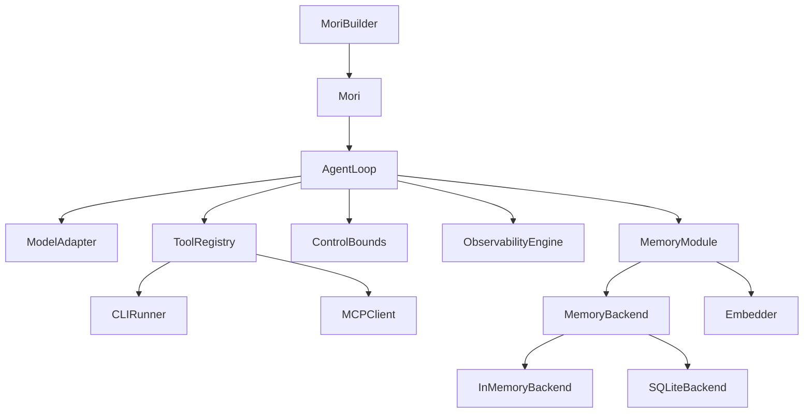

## Key Files Introduced

| File | Purpose |
|------|---------|
| `mori/memory/module.py` | `MemoryModule` — orchestrates read, write, promote, forget |
| `mori/memory/retrieval.py` | 4-stage retrieval pipeline |
| `mori/memory/embedder.py` | `Embedder` protocol + `AnthropicEmbedder` (Voyage AI) |
| `mori/memory/backends/base.py` | `MemoryBackend` protocol (8 methods) |
| `mori/memory/backends/inmemory.py` | Dict + numpy cosine similarity |
| `mori/memory/backends/sqlite.py` | sqlite3 + BLOB embeddings |

## Design Decisions Worth Noting

**Why four layers instead of one?** TTLs, retrieval characteristics, and confidence semantics
differ per layer. Working memory is ephemeral; semantic memory is curated. Mixing them
requires complex per-record filtering on every read. Separate layers make queries cheaper
and semantics explicit.

**Why Voyage AI for embeddings?** `voyage-3` (1024 dimensions) is Anthropic's embedding
partner. 1024-dimensional vectors are compact enough for in-process numpy cosine similarity
without a vector database for moderate record counts (up to ~50k records).

**Why recency_bias = 0.3?** 70% semantic relevance, 30% recency. Agents produce better
answers when recent context from the current session is weighted — but not so heavily that
stale-but-relevant semantic facts are buried.
```

- [ ] **Step 2: Verify build**

```bash
mkdocs build --strict --no-directory-urls 2>&1 | grep -E "WARNING|ERROR|built in"
```

- [ ] **Step 3: Commit**

```bash
git add mori-docs/history/v03-it-remembers.md
git commit -m "docs: add v0.3 version history page"
```

---

## Task 16: v0.4 History Page

**Files:**
- Create: `mori-docs/history/v04-it-learns.md`

- [ ] **Step 1: Create mori-docs/history/v04-it-learns.md**

```markdown
# v0.4 — "It Learns"

**Released:** 2026-04-29
**Specs added:** 04 (Skills Module), 09 (Context Budget Manager)

## What Changed

- **`mori/skills/`** — `SkillsModule`, `FilesystemRegistry`, `SkillManifest`, manifest
  parser with semver + name validation, `SkillCandidate`, `SkillPayload`, `BoundSkill`,
  `SkillHealthReport`
- **`mori/budget/`** — `BudgetManager`, `BudgetConfig`, 6-slot allocation, phase-specific
  overrides, 6-stage compaction pipeline
- **`mori/types.py`** — added `DisclosureLevel`
- **`mori/runtime/state.py`** — added `active_skill_payload`
- **`mori/runtime/loop.py`** — expanded `_phase_retrieve` (skill discovery + load); added
  `_pre_plan_compact` (budget rebalance + compaction); schema deferral in `_assemble_request`
- **`mori/agent.py`** — added `.skill_registry()`, `.budget()` builder methods; `Mori.skills`,
  `Mori.budget` properties
- **`mori/observability/events.py`** — added `SkillDiscoverEvent`, `SkillLoadEvent`,
  `BudgetRebalanceEvent`, `CompactionEvent`
- **`skills/`** — three example skill artifacts: `bug-fix`, `code-review`, `test-generation`
- **`pyproject.toml`** — added `pyyaml>=6.0`

## Why It Mattered

Skills solve a fundamental LLM reliability problem: without guidance, the model improvises.
Improvisation is inconsistent and fragile. A skill converts a recurring task pattern into a
guided composition — the model receives a structured approach alongside the task.

The budget manager solves context overflow. Without managed compaction, long-running agents
either fail with context overflow errors or truncate silently. The 6-stage pipeline degrades
gracefully — cheapest interventions first, most aggressive last — so the agent stays
operational as long as possible.

## Architecture at This Point

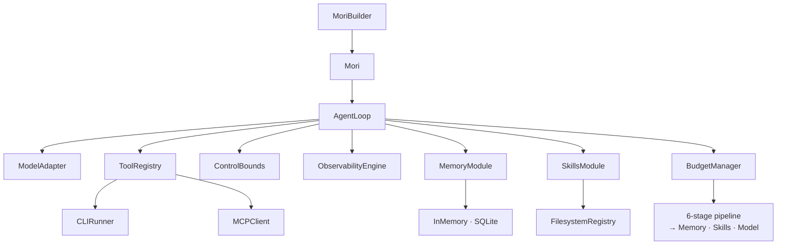

## Key Files Introduced

| File | Purpose |
|------|---------|
| `mori/skills/types.py` | `SkillManifest`, `SkillCandidate`, `SkillPayload`, `BoundSkill`, health types |
| `mori/skills/parser.py` | YAML manifest parser + SKILL.md loader with validation |
| `mori/skills/registry.py` | `FilesystemRegistry`, `CompositeRegistry`, `SkillRegistry` protocol |
| `mori/skills/module.py` | `SkillsModule` — discover, load, bind, health |
| `mori/budget/types.py` | `BudgetSlot`, `BudgetConfig`, `CompactionStage`, `CompactionReport` |
| `mori/budget/manager.py` | `BudgetManager` — allocation, rebalancing, compaction pipeline |

## Design Decisions Worth Noting

**Why progressive disclosure (abstract/summary/full)?** Skill content can be thousands of
tokens. Loading the full content every run wastes budget. The summary (50–500 tokens) gives
the model enough structure. If compaction triggers `_stage_skill_downgrade`, full skill
degrades to summary — reclaiming tokens without losing guidance.

**Why ordered compaction stages?** Each stage has different cost/reclaim tradeoffs.
`RESULT_TRIM` is free (already-received output). `SCHEMA_DEFER` saves tokens with zero
quality loss. `CONVERSATION_SUMMARIZE` is the most expensive (a model call). Running in
order means the agent never pays the cost of summarization if cheaper stages suffice.

**Why only one turn snipped per `TURN_SNIP` invocation?** Conservative by design. One snip
may suffice. If more is needed, later stages handle it. Aggressive multi-snip risks removing
context the model still needs for the current task.
```

- [ ] **Step 2: Verify build**

```bash
mkdocs build --strict --no-directory-urls 2>&1 | grep -E "WARNING|ERROR|built in"
```

- [ ] **Step 3: Commit**

```bash
git add mori-docs/history/v04-it-learns.md
git commit -m "docs: add v0.4 version history page"
```

---

## Task 17: v0.5 History Page

**Files:**
- Create: `mori-docs/history/v05-its-governed.md`

- [ ] **Step 1: Create mori-docs/history/v05-its-governed.md**

```markdown
# v0.5 — "It's Governed"

!!! warning "In Progress"
    v0.5 is currently under active development. This page describes the planned
    implementation. See the [implementation plan](../../superpowers/plans/2026-05-01-mori-v05-its-governed.md)
    for details.

**Target release:** 2026-05
**Specs added:** 06 (Permission Engine), 10 (Plugins & Hooks — partial)

## What's Being Added

- **`mori/permission/`** — `PermissionEngine` with YAML policy files, Unix-style `rwx`
  permissions, fnmatch pattern matching for resources and identities, `ALLOW` / `DENY` /
  `ESCALATE` decisions
- **`mori/control/checkpoint.py`** — `Checkpoint` model, `CheckpointStore` protocol,
  `InMemoryCheckpoints`, `FileCheckpoints`, `SQLiteCheckpoints`
- **`mori/hooks/`** — `HookRegistry`, lifecycle hooks at 6 points: `run.start`,
  `run.end`, `tool.invoke.before`, `tool.invoke.after`, `model.request.before`,
  `model.response.after`
- **`AgentLoop.resume(checkpoint_id)`** — restore checkpoint, re-enter loop from
  paused state
- **`mori/agent.py`** — `.identity()`, `.policy_file()`, `.checkpointer()`, `.hook()`
  builder methods; `Mori.resume()`

## Why It Matters

The ESCALATE → PAUSE → approve → RESUME flow is the key governance primitive. An agent that
can pause on a sensitive tool call, persist its entire state, wait for a human decision, and
resume from exactly where it paused is a governed agent. Without this, every sensitive
operation requires either pre-approval (requiring prediction) or post-hoc review (too late).

Lifecycle hooks give operators visibility and control at key moments without modifying the
loop code. A hook on `tool.invoke.before` can implement rate limiting, compliance logging,
or circuit breaking transparently.

## Planned Architecture

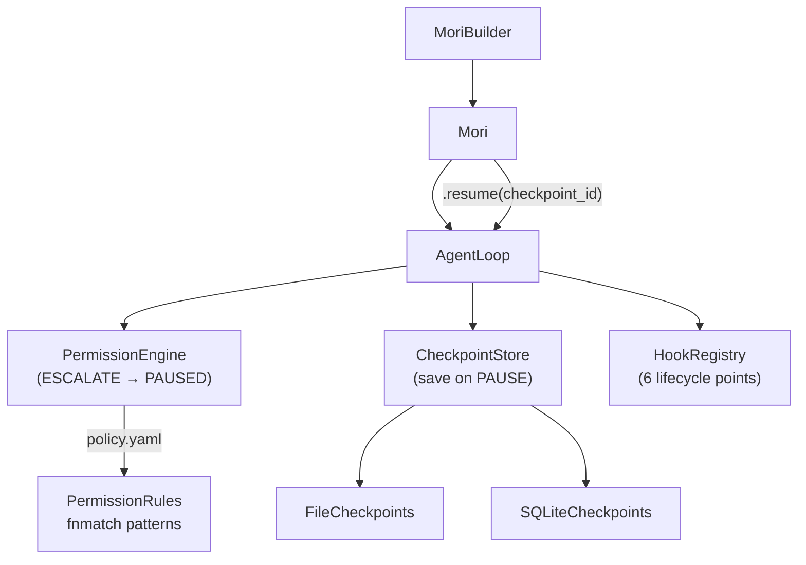

## Governance Flow

```
agent.run(task)
    → loop calls permission.check(identity, tool_call)
        ALLOW   → execute tool normally
        DENY    → return ToolError to model
        ESCALATE → state.status = PAUSED
                   checkpointer.save(state) → checkpoint_id
                   return RunResult(status=PAUSED, checkpoint_id=...)

# Human reviews and approves
agent.resume(checkpoint_id)
    → checkpointer.load(checkpoint_id)
    → re-enter loop from paused state
    → continue normally
```

## Key Files Being Introduced

| File | Purpose |
|------|---------|
| `mori/permission/types.py` | `Identity`, `PermissionRule`, `ResourcePattern`, `PermissionResult` |
| `mori/permission/engine.py` | `PermissionEngine` — resolution algorithm, YAML loader |
| `mori/control/checkpoint.py` | `Checkpoint`, `CheckpointStore` protocol, 3 implementations |
| `mori/hooks/types.py` | `HookConfig`, `HookHandler`, `HookRegistration` |
| `mori/hooks/registry.py` | `HookRegistry` |
```

- [ ] **Step 2: Verify build**

```bash
mkdocs build --strict --no-directory-urls 2>&1 | grep -E "WARNING|ERROR|built in"
```

- [ ] **Step 3: Commit**

```bash
git add mori-docs/history/v05-its-governed.md
git commit -m "docs: add v0.5 version history page (in-progress)"
```

---

## Task 18: V1 Roadmap Page

**Files:**
- Create: `mori-docs/history/v1-roadmap.md`

- [ ] **Step 1: Create mori-docs/history/v1-roadmap.md**

```markdown
# V1 Roadmap

V1 is the complete, production-ready Mori — all 13 specs implemented, with a full governance
layer, AIUC-1 compliance primitives, a plugin/hook system, and integration documentation.

## Remaining Specs

| Spec | Title | What it adds |
|------|-------|-------------|
| 06 | Permission Engine | ESCALATE → PAUSE → resume; YAML policy files; identity-based access *(v0.5, in progress)* |
| 10 | Plugins & Hooks | Lifecycle hooks at 6 points; LangGraph adapter; framework plugin API |
| 11 | Integration Patterns | Cross-module flows, startup sequences, multi-agent patterns, testing guide |
| 12 | AIUC-1 Compliance | Risk taxonomy, PII guard, IP guard, evidence exporter, `ComplianceSummary` |
| 13 | Pi Patterns | Tree sessions, context compaction patterns, AGENTS.md loader, steering, skills compat |

## Complete V1 Module Set

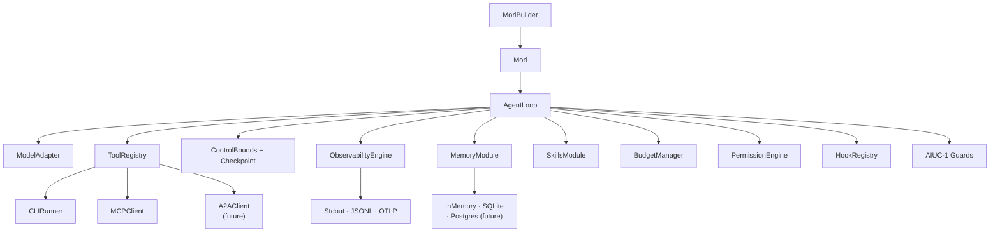

## AIUC-1 Compliance Primitives (Spec 12)

- **`PIIGuard`** — detects and redacts PII in tool inputs/outputs before they enter memory
  or event streams
- **`IPGuard`** — detects potential IP-sensitive content (code, proprietary text)
- **`InputFilterGuard`** — validates inputs against a configurable allowlist/denylist
- **`OutputScopeGuard`** — verifies model outputs stay within the intended scope
- **`EvidenceExporter`** — produces a `ComplianceSummary` from a run's event stream: what
  happened, what data was accessed, what decisions were made

## Pi Patterns (Spec 13)

- **Tree sessions** — hierarchical agent sessions with parent/child context sharing
- **Context compaction patterns** — recipes for long-running agents that outlive their
  context window
- **AGENTS.md loader** — file format for encoding agent identity and capabilities, loaded at
  startup
- **Steering** — mid-run task redirection without restarting
- **Skills compatibility** — inter-agent skill version negotiation

## V1 Governance Flow

```
agent.run(task)
    → hooks: run.start fires
    → per step: hooks: model.request.before fires
    → per tool call:
        hooks: tool.invoke.before fires
        permission.check(identity, resource, permission)
            ALLOW   → execute
            DENY    → ToolError
            ESCALATE → state.status = PAUSED
                       checkpoint saved
                       RunResult(PAUSED) returned
        hooks: tool.invoke.after fires
    → AIUC-1 guards run on tool inputs/outputs
    → hooks: run.end fires

agent.resume(checkpoint_id)
    → checkpoint loaded
    → loop re-enters from paused state
```
```

- [ ] **Step 2: Verify full build with no errors**

```bash
mkdocs build --strict --no-directory-urls 2>&1 | grep -E "WARNING|ERROR|built in"
```

Expected: `INFO - Documentation built in Xs.XXXs.` with no WARNING or ERROR lines. If there
are warnings about missing files in `mori-docs/specs/`, those are OK — those files exist but
are not in the nav. Warnings about missing cross-linked files in `architecture/` or
`history/` are errors to fix.

- [ ] **Step 3: Smoke-test in browser**

```bash
mkdocs serve --no-directory-urls &
# Open http://127.0.0.1:8000 in browser
# Verify: hub page loads, nav has Architecture + Version History tabs,
#         Mermaid diagrams render, admonition on v0.5 page shows warning box
kill %1
```

- [ ] **Step 4: Final commit**

```bash
git add mori-docs/history/v1-roadmap.md
git commit -m "docs: add V1 roadmap page — complete architecture doc site"
```

---

## Self-Review

**Spec coverage check:**

- ✅ Sec 2 (file structure) — all 18 files covered across Tasks 1–18
- ✅ Sec 3 (mkdocs.yml) — Task 1, including `model-adapters` added to nav
- ✅ Sec 4 (6-tier progressive disclosure) — Tasks 4–11 each follow all 6 tiers
- ✅ Sec 5 (hub page content) — Task 2 covers all 5 content requirements
- ✅ Sec 6 (architecture/index.md content) — Task 3 covers all 4 content requirements
- ✅ Sec 7 (version history pages) — Tasks 12–18 cover all 7 pages, each with all 5 sections
- ✅ Sec 8 (module page inventory) — all 8 modules covered, key types documented per module
- ✅ Sec 9 (content standards) — real code snippets, Mermaid diagrams, `???` admonitions, cross-links
- ✅ Sec 10 (out of scope) — no auto-generated API reference, no getting-started section

**No placeholders found.** All code snippets use actual types and method signatures from
the codebase. All file paths are exact.

**Type consistency:** All types referenced in examples match definitions in earlier sections.
`MemoryRecord` fields match `mori/types.py`. Builder methods match `mori/agent.py`.
