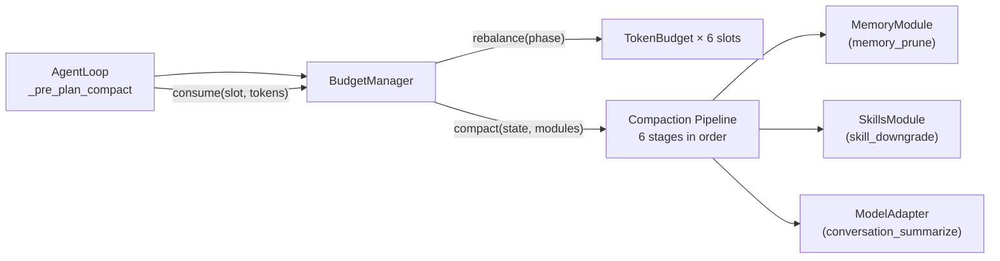

# Budget Manager

## TL;DR

`BudgetManager` tracks how many context tokens each part of the conversation consumes across
six named slots. When total consumption nears the model's context limit (85% by default), it
runs a 6-stage compaction pipeline to reclaim tokens — ordered from cheapest to most
aggressive.

## Role in the System



**Depends on:** nothing at construction; `MemoryModule`, `SkillsModule`, `ModelAdapter`
injected as `CompactionModules` only during `compact()`.

**Called by:** `AgentLoop._pre_plan_compact()`, `AgentLoop._phase_retrieve()` (slot
allocation checks).

## Key Concepts

- **`BudgetSlot`** — Six named slots: `SYSTEM_PROMPT`, `MEMORY`, `SKILL`, `TOOL_SCHEMAS`,
  `CONVERSATION`, `GENERATION`.
- **`TokenBudget`** — Per-slot: `allocated`, `consumed`, `remaining = allocated - consumed`.
- **`BudgetConfig`** — `total_context_tokens` (200k), `compaction_threshold_pct` (0.85),
  `min_generation_tokens` (1000), `max_result_tokens` (4000), `slot_overrides`.
- **`CompactionStage`** — The 6 stages: `RESULT_TRIM`, `SCHEMA_DEFER`, `TURN_SNIP`,
  `SKILL_DOWNGRADE`, `MEMORY_PRUNE`, `CONVERSATION_SUMMARIZE`.
- **`CompactionReport`** — Output of `compact()`: per-stage tokens reclaimed, total reclaimed,
  initial and final utilization.

## API Surface

```python
class BudgetManager:
    def get_allocation(self, slot: BudgetSlot) -> TokenBudget: ...
    def consume(self, slot: BudgetSlot, tokens: int) -> ConsumeResult: ...
    def release(self, slot: BudgetSlot, tokens: int) -> None: ...
    def rebalance(self, phase: Phase,
                  hints: RebalanceHints | None = None) -> dict[BudgetSlot, TokenBudget]: ...
    def needs_compaction(self) -> bool: ...
    def assemble_budget_report(self) -> BudgetReport: ...
    async def compact(self, state: MoriState,
                      modules: CompactionModules) -> CompactionReport: ...
```

## How It Works

### Slot Allocations

Default fractional allocation of `total_context_tokens`:

| Slot | Default | PLAN phase | ACT phase |
|------|---------|------------|-----------|
| `SYSTEM_PROMPT` | 10% | 10% | 10% |
| `MEMORY` | 20% | **25%** | **15%** |
| `SKILL` | 15% | **10%** | **20%** |
| `TOOL_SCHEMAS` | 10% | 10% | **15%** |
| `CONVERSATION` | 30% | 30% | 30% |
| `GENERATION` | 15% | 15% | 15% |

`rebalance(phase)` recalculates each step. Fractions are normalized to sum to 1.0 after
overrides are applied. `GENERATION` is always guaranteed at least `min_generation_tokens`.

### Compaction Pipeline

When `needs_compaction()` is True (consumed > 85% of total), `compact()` runs stages in
order. Each stage fires only if the agent is still over budget — stages are skipped once
back under threshold.

| Stage | What it does | Aggressiveness |
|-------|-------------|----------------|
| `RESULT_TRIM` | Truncates tool result messages to `max_result_tokens` | Minimal |
| `SCHEMA_DEFER` | Sends empty `input_schema: {}` for unused tools | Low |
| `TURN_SNIP` | Removes one oldest tool-call + result round | Medium |
| `SKILL_DOWNGRADE` | Downgrades active skill `FULL` → `SUMMARY` | Medium |
| `MEMORY_PRUNE` | Re-reads memory at half the current token budget | High |
| `CONVERSATION_SUMMARIZE` | Replaces middle messages with a model-generated summary | Highest |

??? note "Why this order?"
    The pipeline is conservative by design. `RESULT_TRIM` reclaims tokens that are already
    fully received (output is done, truncation loses nothing new). `SCHEMA_DEFER` sends less
    data to the model without changing conversation state. Only if those aren't enough does
    the pipeline touch conversation history — and only `CONVERSATION_SUMMARIZE` makes a
    model call, which has latency and cost.

## Annotated Example

```python
from mori import Mori

agent = (
    Mori.builder()
    .model("anthropic")
    .budget(
        total_context_tokens=200_000,
        compaction_threshold_pct=0.85,   # compact when 85% full
        min_generation_tokens=1000,       # always reserve 1k tokens for output
        max_result_tokens=4000,           # trim tool results to 4k tokens
        slot_overrides={                  # override default fractions
            "memory": 0.25,              # give memory more space
            "skill": 0.10,
        },
    )
    .build()
)
```

> **Raw spec:** [`mori-docs/specs/09-CONTEXT-BUDGET.md`](../specs/09-CONTEXT-BUDGET.md)
