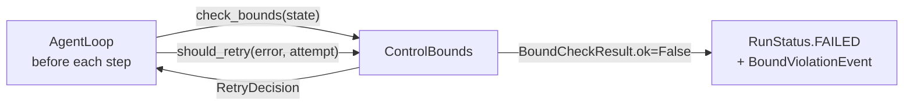

# Control

## TL;DR

`ControlBounds` is the single authority for all resource limits on an agent run. It checks
four bounds before every step and provides exponential backoff retry decisions for failed
tool calls.

## Role in the System



**Depends on:** `MoriState` (read-only for bounds checking).

**Called by:** `AgentLoop` — `check_bounds()` at the top of every loop iteration.

## Key Concepts

- **`ControlConfig`** — The 7 configurable limits.
- **`BoundCheckResult`** — `ok` (bool), `violated_bounds` (list of bound names),
  `current_values` (dict of measured values).
- **`RetryDecision`** — `should_retry` (bool), `wait_sec` (backoff), `attempt` (count).

## API Surface

```python
class ControlConfig(MoriModel):
    max_steps: int = 50                   # hard limit on loop iterations
    max_total_tokens: int = 2_000_000     # cumulative input + output tokens
    step_timeout_sec: float = 120.0       # per-step wall clock (not yet enforced)
    run_timeout_sec: float = 3600.0       # total run wall clock
    idle_timeout_sec: float = 300.0       # no progress recorded for this long
    max_retries_per_tool: int = 2         # tool call retry budget
    retry_backoff_base_sec: float = 1.0   # exponential backoff base

class ControlBounds:
    def check_bounds(self, state: MoriState) -> BoundCheckResult: ...
    def should_retry(self, error: Exception, attempt: int) -> RetryDecision: ...
    def record_progress(self) -> None: ...   # resets idle timer
```

## How It Works

### Bound Checks

`check_bounds()` evaluates all four bounds synchronously before each step:

1. `step_count >= max_steps` → violates `"max_steps"`
2. `total_input_tokens + total_output_tokens >= max_total_tokens` → violates `"max_total_tokens"`
3. `(now - state.started_at).seconds >= run_timeout_sec` → violates `"run_timeout"`
4. `(now - state.last_progress_at).seconds >= idle_timeout_sec` → violates `"idle_timeout"`

Any violation emits a `BoundViolationEvent` and sets `state.status = FAILED`. Multiple bounds
can fire simultaneously.

### Retry Logic

```python
wait = min(base_sec * (2 ** attempt), 60.0)
# attempt=0 → 1s, attempt=1 → 2s, attempt=2 → 4s, ..., capped at 60s
```

Returns `should_retry=False` once `attempt >= max_retries_per_tool`.

### Idle Timeout

The loop calls `record_progress()` after each `RETRY` step. If the agent gets stuck in a
loop making no forward progress (e.g., a tool keeps failing), `idle_elapsed >=
idle_timeout_sec` fires.

## Annotated Example

```python
from mori import Mori

agent = (
    Mori.builder()
    .model("anthropic")
    .config(
        max_steps=10,               # stop after 10 iterations
        run_timeout_sec=60.0,       # stop after 1 minute wall clock
        idle_timeout_sec=30.0,      # stop if no progress for 30s
        max_total_tokens=500_000,   # stop if tokens exceed 500k
    )
    .build()
)
```

> **Raw spec:** [`mori-docs/specs/07-CONTROL.md`](../specs/07-CONTROL.md)
