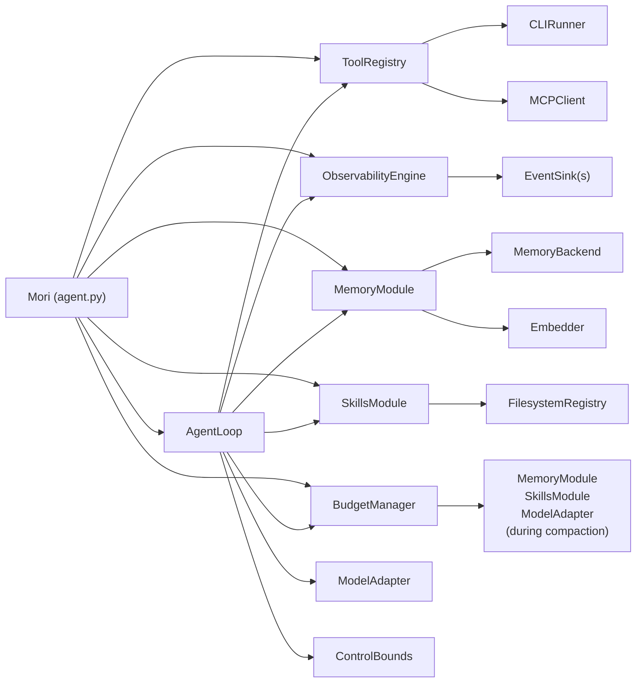
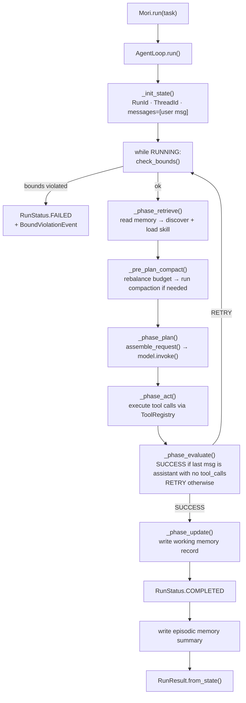

# Architecture Overview

A map of all Mori modules, their dependencies, and the data flow through a complete agent run.

## Module Dependency Graph



## Full Data Flow

A complete `Mori.run(task)` call traverses these phases in sequence for each loop step:



## Context Assembly

Before each model call, `_assemble_request()` builds the message list in this order
(index 0 = injected first, appears earliest in context):

```
index 0: [Skill Context]   ← active skill payload (inserted last, ends up first)
index 1: [Memory Context]  ← retrieved memory records (inserted first)
index 2: user message      ← the original task
index 3+: prior turns      ← assistant + tool messages from previous steps
```

## Builder Wiring

`MoriBuilder.build()` assembles all modules and wires them into a single `AgentLoop`:

```python
# Simplified build() — shows the wiring order
obs     = ObservabilityEngine(sinks)                    # 1. Observability
control = ControlBounds(ControlConfig(**config))        # 2. Control
registry = ToolRegistry()                               # 3. Tools
memory  = MemoryModule(backend, config, embedder)       # 4. Memory  (optional)
skills  = SkillsModule(FilesystemRegistry(path))        # 5. Skills  (optional)
budget  = BudgetManager(BudgetConfig(**budget_cfg))     # 6. Budget  (optional)
loop    = AgentLoop(model, registry, obs, control,      # 7. Loop — holds all modules
                    memory, skills, budget)
return Mori(loop, registry, obs, ...)
```

## Spec Index

| Spec | Title | Module page | Status |
|------|-------|-------------|--------|
| 00 | Overview | *(this page)* | ✅ |
| 01 | Core Types | [`mori/types.py`](../specs/01-CORE-TYPES.md) | ✅ |
| 02 | Runtime | [Runtime](runtime.md) | ✅ |
| 03 | Memory | [Memory](memory.md) | ✅ |
| 04 | Skills | [Skills](skills.md) | ✅ |
| 05 | Tools & Protocols | [Tools & Protocols](tools-and-protocols.md) | ✅ |
| 06 | Permission Engine | *(v0.5 — in progress)* | 🔄 |
| 07 | Control | [Control](control.md) | ✅ |
| 08 | Observability | [Observability](observability.md) | ✅ |
| 09 | Context Budget | [Budget Manager](budget.md) | ✅ |
| 10 | Plugins & Hooks | *(v0.5 — in progress)* | 🔄 |
| 11 | Integration | [V1 Roadmap](../history/v1-roadmap.md) | 📋 |
| 12 | AIUC-1 Compliance | [V1 Roadmap](../history/v1-roadmap.md) | 📋 |
| 13 | Pi Patterns | [V1 Roadmap](../history/v1-roadmap.md) | 📋 |
| 14 | Resilience & Temporal | [Resilience & Temporal](resilience.md) | 📋 |
