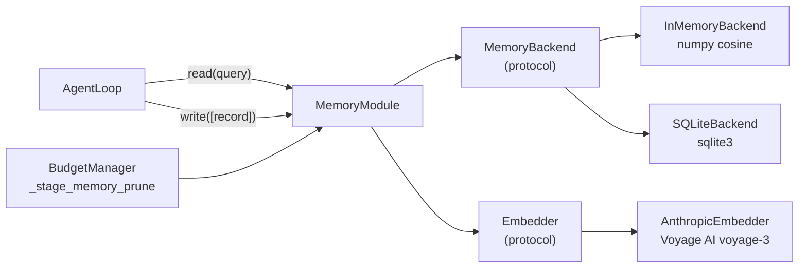

# Memory

## TL;DR

`MemoryModule` gives the agent persistent context across steps and runs. It organizes records
into four layers with different semantics, retrieves the most relevant ones via a 4-stage
pipeline blending semantic similarity with recency, and writes new observations back after
each step.

## Role in the System



**Depends on:** `MemoryBackend` (required); `Embedder` (optional — without it, semantic search
is disabled and `read()` returns an empty slice).

**Called by:** `AgentLoop._phase_retrieve()`, `AgentLoop._phase_update()`,
`BudgetManager._stage_memory_prune()`.

## Key Concepts

- **`MemoryLayer`** — Four layers: `WORKING` (session scratch, 1-hour TTL), `EPISODIC`
  (run history, no TTL), `SEMANTIC` (extracted facts, no TTL), `PERSONALIZED` (user
  preferences, no TTL).
- **`MemoryRecord`** — One memory unit: content string, layer, confidence (0–1), embedding
  vector, provenance tag, optional TTL.
- **`MemorySlice`** — Result of `read()`: a ranked list of records within a token budget, plus
  `total_tokens`, `truncated`, and `conflicts` metadata.
- **`MemoryBackend`** — Protocol any storage implementation must satisfy: insert, get, update,
  delete, search (vector), list_records, count, close.
- **`Embedder`** — Protocol for generating vector embeddings. `AnthropicEmbedder` uses Voyage
  AI's `voyage-3` model (1024 dimensions).
- **`ForgetPolicy`** — Pruning rules: expire TTL-expired records, prune below a confidence
  threshold, deduplicate near-identical vectors.
- **`WriteReceipt`** — Returned from `write()`: created record IDs, layer, timestamp.

## API Surface

```python
class MemoryModule:
    async def read(
        self,
        query: str,
        layers: list[MemoryLayer] | None = None,  # None = all 4 layers
        max_tokens: int = 2000,
        recency_bias: float = 0.3,
        filters: MemoryFilters | None = None,
        task_context: str = "",
    ) -> MemorySlice: ...

    async def write(self, records: list[MemoryRecord]) -> WriteReceipt: ...
    async def update(self, record_id: MemoryRecordId, content: str | None = None,
                     metadata: dict | None = None,
                     confidence: float | None = None) -> MemoryRecord: ...
    async def delete(self, record_ids: list[MemoryRecordId]) -> int: ...
    async def promote(self, source_layer: MemoryLayer, target_layer: MemoryLayer,
                      record_ids: list[MemoryRecordId],
                      abstraction_fn: Callable | None = None) -> list[MemoryRecordId]: ...
    async def forget(self, policy: ForgetPolicy | None = None) -> ForgetReport: ...
    async def stats(self) -> MemoryStats: ...
    async def close(self) -> None: ...
```

```python
@runtime_checkable
class MemoryBackend(Protocol):
    async def insert(self, records: list[MemoryRecord]) -> list[MemoryRecordId]: ...
    async def search(self, embedding: list[float], layer: MemoryLayer | None = None,
                     limit: int = 20, filters: MemoryFilters | None = None
                     ) -> list[tuple[MemoryRecord, float]]: ...
    async def list_records(self, layer: MemoryLayer, limit: int = 100,
                           order_by: Literal["created_at","updated_at","confidence"] = "created_at"
                           ) -> list[MemoryRecord]: ...
    async def count(self, layer: MemoryLayer | None = None) -> int: ...
    async def close(self) -> None: ...
```

## How It Works

### The Four Layers

| Layer | Purpose | Default TTL | Default max records |
|-------|---------|-------------|---------------------|
| `WORKING` | Per-session scratch: tool results, intermediate reasoning | 3600s | 200 |
| `EPISODIC` | Run history: what happened, what tools were used, outcomes | None | 10,000 |
| `SEMANTIC` | Extracted facts and domain knowledge | None | 50,000 |
| `PERSONALIZED` | User preferences and behavioral patterns | None | 5,000 |

### Retrieval Pipeline

`retrieve()` in `mori/memory/retrieval.py` runs five stages:

**Stage 1 — Query Expansion**
```python
expanded = f"{query} {task_context}".strip()
```

**Stage 2 — Multi-Layer Fan-Out**
```python
embeddings = await embedder.embed([expanded])
for layer in search_layers:
    results = await backend.search(embedding=embeddings[0], layer=layer, limit=20)
    all_results.extend(results)
```

**Stage 3 — Relevance Scoring**
```python
# recency_score decays exponentially with a 1-day half-life
recency_score = exp(-age_seconds / 86400.0)
composite = (1.0 - recency_bias) * cosine_sim + recency_bias * recency_score
# Default: 70% semantic relevance, 30% recency
```

**Stage 4 — Budget-Aware Truncation**
```python
for record, _ in sorted(scored, key=score, reverse=True):
    tokens = len(record.content) // 4
    if total_tokens + tokens > max_tokens and selected:
        truncated = True; break
    selected.append(record)
    total_tokens += tokens
```

**Stage 5 — Conflict Detection** (stub — returns `conflicts=[]` currently)

??? note "Backend implementations"
    **`InMemoryBackend`** — dict-backed with numpy cosine similarity. Fast, no persistence.
    Good for tests and short-lived agents.

    **`SQLiteBackend`** — sqlite3-backed. Embeddings stored as BLOBs. Persists across process
    restarts. Good for development and single-instance production.

    To add a new backend, implement the 8-method `MemoryBackend` protocol — no inheritance
    required.

### Forget Lifecycle

`MemoryModule.forget(policy)` sweeps all layers:

- `expire_ttl=True` — deletes records where `(now - created_at).seconds > ttl_seconds`
- `prune_below_confidence=0.2` — deletes records with `confidence < 0.2`

The loop does **not** call `forget()` automatically — callers must schedule it (e.g., once
per hour for a long-running agent).

## Annotated Example

```python
import asyncio, secrets
from datetime import datetime, timezone
from mori import Mori
from mori.types import MemoryRecord, MemoryRecordId, MemoryLayer

async def main():
    agent = (
        Mori.builder()
        .model("anthropic")
        .memory_backend("sqlite", path="agent_memory.db")
        .build()
    )

    # Seed a semantic fact before running
    await agent.memory.write([
        MemoryRecord(
            record_id=MemoryRecordId(f"mem_{secrets.token_hex(8)}"),
            layer=MemoryLayer.SEMANTIC,
            content="Paris is the capital of France with a population of ~2.1M.",
            created_at=datetime.now(timezone.utc),
            updated_at=datetime.now(timezone.utc),
            confidence=0.95,
            provenance="manual_seed",
        )
    ])

    # _phase_retrieve will find this record and inject it as [Memory Context]
    result = await agent.run("What do you know about Paris?")
    print(result.final_output)
    await agent.close()

asyncio.run(main())
```

> **Raw spec:** [`mori-docs/specs/03-MEMORY.md`](../specs/03-MEMORY.md)
