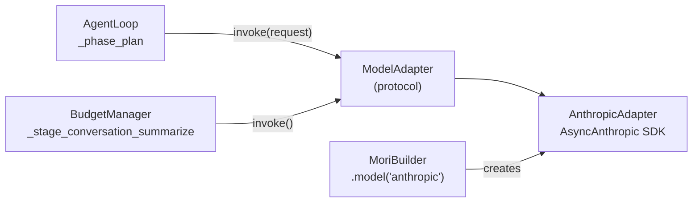

# Model Adapters

## TL;DR

`ModelAdapter` is the protocol all LLM provider integrations must implement. `AnthropicAdapter`
is the built-in implementation for Claude models via the Anthropic SDK. The adapter handles
message format conversion, system message extraction, and tool call parsing.

## Role in the System



**Depends on:** `anthropic` SDK (optional import — raises `ImportError` with install
instructions if missing).

**Called by:** `AgentLoop._phase_plan()`, `BudgetManager._stage_conversation_summarize()`.

## Key Concepts

- **`ModelAdapter`** — A `@runtime_checkable Protocol` with 5 methods. Any object
  implementing these methods is a valid adapter.
- **`StreamChunk`** — Typed streaming delta: `type` (text_delta, tool_call_start, etc.),
  `text`, `tool_call`, `usage`.
- **`AnthropicAdapter`** — Wraps `anthropic.AsyncAnthropic`. Converts Mori message format
  to Anthropic's format and back.

## API Surface

```python
@runtime_checkable
class ModelAdapter(Protocol):
    async def invoke(self, request: ModelRequest) -> ModelResponse: ...
    async def stream(self, request: ModelRequest) -> AsyncIterator[StreamChunk]: ...
    async def count_tokens(self, text: str) -> int: ...

    @property
    def max_context_tokens(self) -> int: ...
    @property
    def model_id(self) -> str: ...
    @property
    def supports_tool_use(self) -> bool: ...
```

```python
class ModelRequest(MoriModel):
    messages: list[Message]
    tools: list[ToolSpec] | None = None
    max_tokens: int = 4096
    temperature: float = 0.0
    stop_sequences: list[str] | None = None
    metadata: dict[str, Any] = Field(default_factory=dict)

class ModelResponse(MoriModel):
    message: Message
    usage: TokenUsage
    stop_reason: Literal["end_turn", "tool_use", "max_tokens", "stop_sequence"]
    raw: dict[str, Any]
```

## How It Works

### Message Conversion

Anthropic's API requires alternating user/assistant roles and a separate `system` parameter.
`AnthropicAdapter` performs three transformations:

**1. System extraction** — `_extract_system()` collects all messages with `role="system"`,
concatenates their content, and passes it as Anthropic's `system=` parameter (removed from
the message list).

**2. Tool result merging** — Consecutive tool result messages must merge into a single user
message with a list of `tool_result` content blocks:

```python
# Mori internal format — two separate messages:
Message(role="tool", content="42",     tool_call_id="call_1")
Message(role="tool", content="Paris",  tool_call_id="call_2")

# Anthropic format — one user message with two blocks:
{"role": "user", "content": [
    {"type": "tool_result", "tool_use_id": "call_1", "content": "42"},
    {"type": "tool_result", "tool_use_id": "call_2", "content": "Paris"},
]}
```

**3. Tool call conversion** — Assistant messages with tool calls become mixed content blocks
(text block + tool_use blocks).

### Supported Models

| Model ID | Context window |
|----------|----------------|
| `claude-sonnet-4-20250514` | 200,000 tokens |
| `claude-opus-4-20250514` | 200,000 tokens |
| `claude-haiku-3-5-20241022` | 200,000 tokens |

All other model IDs fall back to 200,000 tokens.

### Current Limitations

- **`stream()`** raises `NotImplementedError` — streaming not implemented in current version.
- **`count_tokens()`** uses `len(text) // 4` heuristic, not the Anthropic token counting API.

## Annotated Example

```python
import asyncio

# Using the builder (recommended)
from mori import Mori
agent = Mori.builder().model("anthropic", model="claude-sonnet-4-20250514", max_tokens=8192).build()

# Using the adapter directly (for testing or custom loops)
from mori.model.anthropic import AnthropicAdapter
from mori.types import ModelRequest, Message

async def direct():
    adapter = AnthropicAdapter(model="claude-sonnet-4-20250514")
    response = await adapter.invoke(ModelRequest(
        messages=[Message(role="user", content="Hello")]
    ))
    print(response.message.content)    # "Hello! How can I help you?"
    print(response.usage.total)        # total tokens used
    print(response.stop_reason)        # "end_turn"

asyncio.run(direct())
```

> **Raw spec:** [`mori-docs/specs/02-RUNTIME.md`](../specs/02-RUNTIME.md) (Sections 10–12)
