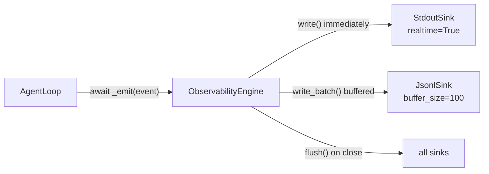

# Observability

## TL;DR

`ObservabilityEngine` captures every meaningful event in an agent run and dispatches them to
pluggable sinks. Sinks can be real-time (stdout) or batched (JSONL). All 13 event types are
structured Pydantic models, fully serializable to JSON.

## Role in the System



**Depends on:** `EventSink` implementations (none required — engine is nil-safe).

**Called by:** `AgentLoop` at 13+ points per run.

## Key Concepts

- **`MoriEvent`** — Base class: `event_id`, `event_type`, `timestamp`, `run_id`, optional
  `step_id`, `trace_id`, `span_id`, `risk_flags`, `metadata`.
- **`EventSink`** — Protocol: `write(event)`, `write_batch(events)`, `flush()`, `close()`.
- **`ObservabilityConfig`** — Controls buffer size (100), flush interval (5s), what to
  include, max content length, enabled event type filter.
- **`SpanContext`** — Trace span: `trace_id`, `span_id`, `parent_span_id`, `name`,
  `start_time`, `end_time`, `duration_ms` (computed property).
- **`RunSummary`** — Aggregated view post-run: steps, tokens, tool calls/failures, tools used,
  errors.

## API Surface

```python
class ObservabilityEngine:
    async def emit(self, event: MoriEvent) -> None: ...
    async def emit_batch(self, events: list[MoriEvent]) -> None: ...
    def start_trace(self, run_id: RunId) -> TraceId: ...
    def start_span(self, trace_id: TraceId, name: str,
                   parent_span_id: str | None = None) -> SpanContext: ...
    def end_span(self, span: SpanContext) -> None: ...
    def get_run_summary(self, run_id: RunId) -> RunSummary: ...
    async def flush(self) -> None: ...
    async def close(self) -> None: ...

@runtime_checkable
class EventSink(Protocol):
    async def write(self, event: MoriEvent) -> None: ...
    async def write_batch(self, events: list[MoriEvent]) -> None: ...
    async def flush(self) -> None: ...
    async def close(self) -> None: ...
```

## How It Works

### Event Taxonomy

| Event type | Class | Emitted when |
|------------|-------|-------------|
| `run.start` | `RunStartEvent` | `AgentLoop.run()` begins |
| `run.end` | `RunEndEvent` | `AgentLoop.run()` exits |
| `step.start` | `StepStartEvent` | Each step iteration begins |
| `step.end` | `StepEndEvent` | Each step iteration ends |
| `tool.invoke` | `ToolInvokeEvent` | Before each tool call |
| `tool.result` | `ToolResultEvent` | After each tool call |
| `control.bound_violation` | `BoundViolationEvent` | A resource bound is exceeded |
| `memory.read` | `MemoryReadEvent` | After `MemoryModule.read()` |
| `memory.write` | `MemoryWriteEvent` | After `MemoryModule.write()` |
| `skill.discover` | `SkillDiscoverEvent` | After `SkillsModule.discover()` |
| `skill.load` | `SkillLoadEvent` | After `SkillsModule.load()` |
| `budget.rebalance` | `BudgetRebalanceEvent` | After `BudgetManager.rebalance()` |
| `budget.compaction` | `CompactionEvent` | After `BudgetManager.compact()` |

### Buffering Strategy

`ObservabilityEngine` checks the `realtime` attribute on each sink:

- **`StdoutSink`** — `realtime = True`: `write()` is called immediately on every `emit()`.
  Events appear as they fire (interactive feedback).
- **`JsonlSink`** — no `realtime`: events accumulate in `_buffer`. Buffer flushes when it
  reaches `buffer_size` (100 events) or when `flush()`/`close()` is called (efficient I/O).

??? note "Adding a custom sink"
    Implement the 4-method `EventSink` protocol. For custom sinks, construct
    `ObservabilityEngine([your_sink], ObservabilityConfig())` directly and pass it to
    `AgentLoop`. The builder's `.sink()` method only accepts `"stdout"` and `"jsonl"` by name.

## Annotated Example

```python
import asyncio
from mori import Mori

async def main():
    agent = (
        Mori.builder()
        .model("anthropic")
        .sink("stdout")                       # real-time console output
        .sink("jsonl", path="traces.jsonl")   # buffered JSONL traces
        .build()
    )
    result = await agent.run("Hello, Mori!")

    # Get a summary of this run from the engine
    summary = agent._obs.get_run_summary(result.run_id)
    print(f"Steps: {summary.total_steps}")
    print(f"Tokens: {summary.total_input_tokens + summary.total_output_tokens}")
    await agent.close()   # flushes and closes all sinks

asyncio.run(main())
```

> **Raw spec:** [`mori-docs/specs/08-OBSERVABILITY.md`](../specs/08-OBSERVABILITY.md)
