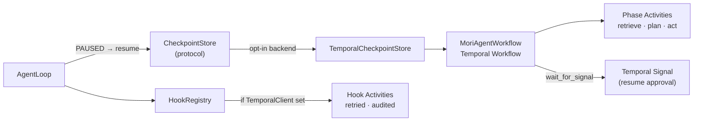

# Resilience & Temporal

## TL;DR

`mori.resilience` makes Mori's agent loop durable by backing it with [Temporal](https://temporal.io).
It replaces the checkpoint-poll loop with live Temporal Signals, maps each loop phase to a
retryable Temporal Activity, and turns `ThreadId` into a Temporal Workflow ID — all without
changing Mori's public API. The native runtime remains the default; Temporal is an opt-in
backend choice.

## Role in the System



**Depends on:** `CheckpointStore` protocol (Spec 07), `HookRegistry` (Spec 10),
`temporalio` SDK (optional — installed via `mori[temporal]`).

**Called by:** `AgentLoop` — detects `TemporalCheckpointStore` and routes pause/resume
through Temporal Signals instead of the native poll loop.

## Key Concepts

- **`TemporalCheckpointStore`** — Drop-in `CheckpointStore` backend. `save()` starts or
  signals a Temporal workflow; `load()` queries it; `delete()` terminates it.
- **`MoriAgentWorkflow`** — Temporal Workflow wrapping `_run_from_state()`. Each step is a
  sequence of Activity calls. Durable execution replaces explicit save/restore.
- **Phase activities** — Each `_phase_*` function wrapped as a `@activity.defn` with its
  own retry policy and schedule-to-close timeout.
- **Hook activities** — `HookRegistry` dispatches as Temporal Activities when a
  `TemporalClient` is configured, gaining automatic retries and an audit trail.
- **`ThreadId` → Workflow ID** — Mori's durable conversation identifier maps 1:1 to the
  Temporal Workflow ID. Every thread becomes queryable and signal-able from Temporal's UI.

## API Surface

```python
# Drop-in replacement for any CheckpointStore backend
from mori.resilience import TemporalCheckpointStore

loop = AgentLoop(
    model=model,
    tools=tools,
    checkpointer=TemporalCheckpointStore(
        client=temporal_client,
        task_queue="mori-agents",
    ),
)

# pause/resume API is unchanged
checkpoint_id = await loop.pause(run_id)
result = await loop.resume(thread_id, input={"approval": True})
```

```python
# Optional extras install
# pip install "mori[temporal]"

from temporalio.client import Client
from mori.resilience import TemporalCheckpointStore

temporal_client = await Client.connect("localhost:7233")
store = TemporalCheckpointStore(client=temporal_client, task_queue="mori-agents")
```

## How It Works

### PAUSED State → Temporal Signal

The native PAUSED flow polls a checkpoint store:

```
ESCALATE → save checkpoint → caller polls load_latest() → loop.resume()
```

With `TemporalCheckpointStore`, the workflow stays live and waits for a Signal:

```
ESCALATE → workflow pauses at wait_for_signal() → no polling
         → caller: client.signal_workflow(thread_id, "resume", input)
         → workflow continues from exact paused state
```

### Phase Activities

Each runtime phase becomes a retryable Temporal Activity:

```python
@activity.defn(name="mori_phase_retrieve")
async def phase_retrieve_activity(state: MoriState) -> MoriState: ...

@activity.defn(name="mori_phase_plan")
async def phase_plan_activity(state: MoriState) -> MoriState: ...

@activity.defn(name="mori_phase_act")
async def phase_act_activity(state: MoriState) -> MoriState: ...
```

Each activity gets an independent retry policy and timeout. `plan` and `act` can run on
separate Temporal worker pools.

### Migration Path

Adoption is staged — each stage is independently deployable:

| Stage | What changes | API impact |
|-------|-------------|------------|
| 1. `TemporalCheckpointStore` | Swap backend; PAUSED uses Signals | None |
| 2. Phase activities | Phases run as Temporal Activities | None |
| 3. Full workflow | `_run_from_state` is a Temporal Workflow | None |
| 4. Hook activities | Hooks dispatch as Temporal Activities | Optional |

A team can adopt stage 1 without committing to stage 3.

??? note "What Temporal replaces"
    | Mori primitive | Native behavior | With Temporal |
    |---|---|---|
    | `CheckpointStore` | Serialize to SQLite/file | Workflow state in Temporal history |
    | `RunStatus.PAUSED` + `loop.resume()` | Poll for state change | Temporal Signal — live wait, no polling |
    | `ThreadId` | Opaque conversation ID | Temporal Workflow ID — queryable from UI |
    | `HookRegistry` events | `asyncio.wait_for` callbacks | Activity with retry + timeout |
    | `_phase_*` functions | Sequential async calls | Activity per phase, independent retry |

## Annotated Example

```python
import asyncio
from temporalio.client import Client
from mori import Mori
from mori.resilience import TemporalCheckpointStore

async def main():
    temporal_client = await Client.connect("localhost:7233")

    agent = (
        Mori.builder()
        .model("anthropic")
        .tool(file_reader, description="Read a file", name="read_file")
        # Swap the checkpointer — everything else is identical
        .checkpointer(TemporalCheckpointStore(
            client=temporal_client,
            task_queue="mori-agents",
        ))
        .build()
    )

    result = await agent.run("Summarize the repo")

    if result.status == RunStatus.PAUSED:
        # The workflow is live in Temporal — no polling needed.
        # Signal it from anywhere:
        await temporal_client.get_workflow_handle(str(result.thread_id)).signal(
            "resume", {"approval": True}
        )

asyncio.run(main())
```

> **Raw spec:** [`mori-docs/specs/14-RESILIENCE.md`](../specs/14-RESILIENCE.md)
