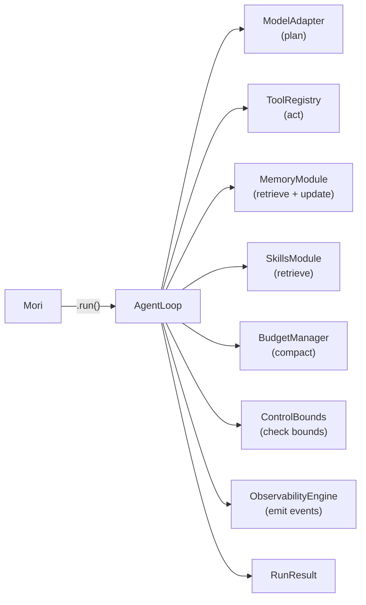

# Runtime

## TL;DR

`AgentLoop` is Mori's execution core — a 6-phase async loop that drives one agent "turn":
retrieve context → compact budget → invoke model → execute tools → evaluate outcome → persist
to memory. It runs until the model produces a final answer or a control bound is hit.

## Role in the System



**Depends on:** `ModelAdapter`, `ToolRegistry`, `ControlBounds`, `ObservabilityEngine` (required);
`MemoryModule`, `SkillsModule`, `BudgetManager` (optional — all nil-safe).

**Called by:** `Mori.run()`.

## Key Concepts

- **`AgentLoop`** — The execution engine. Holds references to all modules; drives the phase sequence per step.
- **`MoriState`** — Mutable state carried across every step: message history, counters, memory slice, active skill payload.
- **`RunResult`** — Immutable summary returned to the caller: final output, total steps, token usage, duration.
- **`StepResult`** — Per-step summary (outcome, token usage, duration).
- **`Phase`** — Enum of 7 declared phases: `RETRIEVE`, `PLAN`, `VALIDATE`, `ACT`, `OBSERVE`, `EVALUATE`, `UPDATE`.
- **`RunStatus`** — Current lifecycle state: `PENDING` → `RUNNING` → `COMPLETED` / `FAILED` / `PAUSED` / `CANCELLED`.
- **`StepOutcome`** — Result of `_phase_evaluate`: `SUCCESS` (done), `RETRY` (keep looping), `ESCALATE`, `SKIP`.

## API Surface

```python
class AgentLoop:
    def __init__(
        self,
        model: ModelAdapter,
        tools: ToolRegistry,
        observability: ObservabilityEngine | None = None,
        control: ControlBounds | None = None,   # defaults to ControlConfig()
        memory: MemoryModule | None = None,
        skills: SkillsModule | None = None,
        budget: BudgetManager | None = None,
    ) -> None: ...

    async def run(
        self,
        task: str,
        thread_id: ThreadId | None = None,
        context: dict[str, Any] | None = None,
    ) -> RunResult: ...
```

```python
class MoriState(MoriModel):
    run_id: RunId
    thread_id: ThreadId
    task: str
    context: dict[str, Any]
    messages: list[Message]           # grows each step
    status: RunStatus
    memory_slice: MemorySlice | None  # set during _phase_retrieve
    active_skill_payload: Any | None  # set during _phase_retrieve
    step_count: int
    total_input_tokens: int
    total_output_tokens: int
    total_tool_calls: int
    started_at: datetime
    last_progress_at: datetime
```

```python
class RunResult(MoriModel):
    run_id: RunId
    thread_id: ThreadId
    status: RunStatus
    task: str
    final_output: str | None          # last assistant text message
    messages: list[Message]           # full conversation history
    total_steps: int
    total_usage: TokenUsage
    total_tool_calls: int
    total_duration_ms: float
    checkpoint_id: CheckpointId | None
```

## How It Works

### The Step Loop

Each iteration of `while state.status == RUNNING`:

1. **`check_bounds()`** — `ControlBounds.check_bounds(state)` validates step count, total tokens,
   run elapsed time, and idle elapsed time. Any violation sets `status = FAILED` immediately
   and emits a `BoundViolationEvent`.

2. **`_phase_retrieve(state)`** — If memory is configured: reads the most relevant records
   for the task (`MemoryModule.read()`), stores the result in `state.memory_slice`, charges
   the `MEMORY` budget slot. If skills are configured: discovers candidates
   (`SkillsModule.discover()`), loads the top match (`SkillsModule.load()` at `SUMMARY` level),
   stores it in `state.active_skill_payload`, charges the `SKILL` budget slot.

3. **`_pre_plan_compact(state)`** — If a budget is configured: rebalances slot allocations for
   the `PLAN` phase, then checks `needs_compaction()`. If over the 85% threshold, runs the
   6-stage compaction pipeline via `BudgetManager.compact()`.

4. **`_phase_plan(state)`** — Calls `_assemble_request(state)` to build the message list
   (with memory and skill injected as system messages), then calls `model.invoke(request)`.
   Appends the assistant response to `state.messages`.

5. **`_phase_act(state)`** — If the last message has tool calls, executes each via
   `ToolRegistry.invoke()`. Appends tool result messages to `state.messages`.

6. **`_phase_evaluate(state)`** — Returns `SUCCESS` if the last message is a plain assistant
   message (no tool calls). Returns `RETRY` otherwise.

7. **`_phase_update(state)`** — If memory is configured, writes a working-memory record
   summarizing the step.

### Post-Run Episodic Write

After the loop exits with `COMPLETED`, if memory is configured, a second write creates an
episodic memory record: the run summary (task, status, steps, tools used, final output excerpt).

### Context Assembly

`_assemble_request()` injects context at the front of the message list:

```python
messages = list(state.messages)
# Memory inserted first (goes to index 0)
if state.memory_slice and state.memory_slice.records:
    messages.insert(0, Message(role="system", content="[Memory Context]\n..."))
# Skill inserted second (pushes memory to index 1, skill is at index 0)
if state.active_skill_payload:
    messages.insert(0, Message(role="system", content="[Skill Context] ..."))
```

Result: skill context is always closest to the model's attention window.

??? note "Schema deferral during compaction"
    After `BudgetManager._stage_schema_defer()` fires, `_assemble_request()` sends only
    empty `input_schema: {}` for tools that weren't used in the last 6 messages. This
    can reclaim thousands of tokens when many tools are registered but few are actively used.

## Annotated Example

```python
import asyncio
from mori import Mori

async def main():
    agent = (
        Mori.builder()
        .model("anthropic")
        .tool(lambda city: f"{city}: 72°F", description="Get weather", name="get_weather")
        .sink("stdout")
        .build()
    )

    result = await agent.run("What's the weather in Paris?")
    # Step 1: model calls get_weather(city="Paris")
    # Step 2: tool returns "Paris: 72°F", model says "The weather in Paris is 72°F."
    # → StepOutcome.SUCCESS → RunStatus.COMPLETED

    print(result.final_output)       # "The weather in Paris is 72°F."
    print(result.total_steps)        # 2
    print(result.total_tool_calls)   # 1
    await agent.close()

asyncio.run(main())
```

> **Raw spec:** [`mori-docs/specs/02-RUNTIME.md`](../specs/02-RUNTIME.md)
