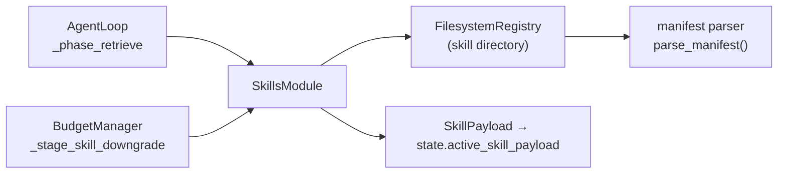

# Skills

## TL;DR

`SkillsModule` loads task-specific guidance into the agent's context at runtime. Skills live
as YAML + Markdown files on the filesystem. When a task matches, the skill's content is
injected as a system message — at three levels of detail (abstract, summary, full) to manage
token cost.

## Role in the System



**Depends on:** `FilesystemRegistry` (required); `Embedder` (optional — without it, discovery
returns skills in directory order with uniform scores).

**Called by:** `AgentLoop._phase_retrieve()`, `BudgetManager._stage_skill_downgrade()`.

## Key Concepts

- **`SkillManifest`** — Parsed `manifest.yaml`: name, version, description, capabilities,
  preconditions (tools required, min context tokens), progressive disclosure content.
- **`DisclosureLevel`** — `ABSTRACT` (<100 chars), `SUMMARY` (<500 tokens), `FULL`
  (complete SKILL.md). The loop always loads at `SUMMARY`; compaction can downgrade `FULL`.
- **`SkillCandidate`** — A manifest + compatibility report + relevance score from `discover()`.
- **`CompatibilityReport`** — Whether the skill's required tools are available and whether
  there's enough context budget.
- **`SkillPayload`** — Loaded content at a given disclosure level: `skill_id`,
  `disclosure_level`, `content`, `token_estimate`.
- **`BoundSkill`** — A payload with its required tools resolved to live `ToolSpec` objects.
- **`FilesystemRegistry`** — Scans a root directory for skill subdirectories, lazy-loads
  and caches manifests.

## API Surface

```python
class SkillsModule:
    def discover(
        self,
        task: str,
        available_tools: list[str],
        available_tokens: int = 999_999,
        max_candidates: int = 5,
    ) -> list[SkillCandidate]: ...

    async def load(
        self, skill_id: str, disclosure_level: str, max_tokens: int
    ) -> SkillPayload: ...

    def bind(self, payload: SkillPayload, available_tools: list[ToolSpec]) -> BoundSkill: ...
    def record_outcome(self, skill_id: str, outcome: SkillExecutionOutcome) -> None: ...
    def health(self, skill_id: str) -> SkillHealthReport: ...
```

### manifest.yaml schema

```yaml
name: bug-fix               # alphanumeric/hyphen/underscore, required
version: 1.0.0              # semver (X.Y.Z), required
description: "..."          # human-readable, required
capabilities: [debugging, test-repair]
scope:
  domains: [code, testing]
preconditions:
  tools_required: [file-reader, test-runner]  # must be in ToolRegistry
  min_context_tokens: 500
constraints:
  max_files: 10
triggers:
  semantic: ["fix failing test", "debug", "broken"]
progressive_disclosure:
  abstract: "Fix a failing test by isolating and patching the root cause."  # <100 chars
  summary: "Read the failing test... [<500 tokens of prose]"
  full: SKILL.md   # pointer to full content file
```

## How It Works

### Discovery

`discover()` calls `registry.search(task, limit=50)`, then for each manifest:

1. **Compatibility check** — verifies all `tools_required` are in `available_tools` AND
   `available_tokens >= min_context_tokens`. Incompatible skills are filtered out entirely.
2. **Scoring** — currently `1.0` for all candidates when no embedder is present (registry
   order preserved). With an embedder: cosine similarity against semantic trigger embeddings.
3. Returns sorted candidates up to `max_candidates`.

The loop takes `candidates[0]` only if `compatibility_report.context_fits` is True.

### Progressive Disclosure

| Level | Source | Typical cost |
|-------|--------|-------------|
| `ABSTRACT` | `manifest.yaml → progressive_disclosure.abstract` | ~10–25 tokens |
| `SUMMARY` | `manifest.yaml → progressive_disclosure.summary` | ~50–500 tokens |
| `FULL` | `SKILL.md` (entire file, truncated to budget) | hundreds–thousands |

The loop always loads at `SUMMARY`. If compaction triggers `_stage_skill_downgrade`, a `FULL`
payload is replaced with `SUMMARY`, reclaiming tokens without losing guidance entirely.

### Skill Injection

The loaded `SkillPayload` is stored in `state.active_skill_payload`. In
`_assemble_request()`, it becomes the first system message:

```
[Skill Context] (bug-fix)
Read the failing test to understand expected behaviour. Run it to capture
the error. Read the source under test...
```

### Skill Health Tracking

`record_outcome()` appends a `SkillExecutionOutcome` to a per-skill deque (max 50). `health()`
computes success rate, avg steps, common failure reasons, and staleness (>90 days unused)
from the window.

## Annotated Example

```python
# skills/ layout:
# skills/code-review/manifest.yaml
# skills/code-review/SKILL.md

import asyncio
from mori import Mori

async def main():
    agent = (
        Mori.builder()
        .model("anthropic")
        .skill_registry("./skills")           # point at skills directory
        .budget(total_context_tokens=200_000)
        .build()
    )

    # _phase_retrieve calls skills.discover("Review this Python function...")
    # → finds code-review skill (tools_required=[], context fits)
    # → loads at SUMMARY level, injects as first system message
    result = await agent.run("Review this Python function: def add(a,b): return a-b")
    print(result.final_output)
    await agent.close()

asyncio.run(main())
```

> **Raw spec:** [`mori-docs/specs/04-SKILLS.md`](../specs/04-SKILLS.md)
