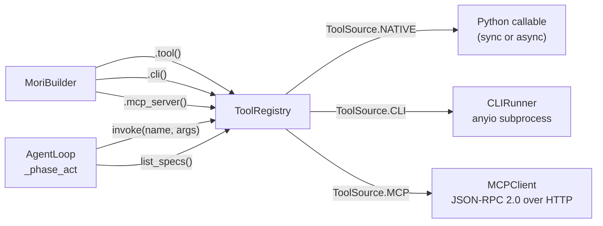

# Tools & Protocols

## TL;DR

`ToolRegistry` is the single source of truth for all tools available to an agent. It manages
three kinds of tools — native Python callables, CLI subprocess wrappers, and MCP server tools
— behind a unified `invoke()` interface. It also tracks per-tool call metrics.

## Role in the System



**Depends on:** `CLIRunner` (CLI tools), `MCPClient` (MCP tools), `infer_schema()` (auto
schema generation).

**Called by:** `AgentLoop._phase_act()` (invoke), `AgentLoop._assemble_request()` (list_specs).

## Key Concepts

- **`ToolSpec`** — The model's view of a tool: `tool_id`, `name`, `description`,
  `input_schema` (JSON Schema), `source`, optional `server_id`, `tags`.
- **`RegisteredTool`** — Internal entry: `ToolSpec` + optional Python callable `fn`.
- **`ToolSource`** — Enum: `NATIVE`, `CLI`, `MCP`, `A2A`, `OPENAPI`.
- **`ToolResult`** — Invocation result: `tool_name`, `call_id`, `success`, `content`,
  `error`, `latency_ms`, `metadata`.
- **`ToolMetrics`** — Per-tool counters: `total_calls`, `total_errors`, `avg_latency_ms`,
  `error_rate`, `last_called`.
- **`CLIRunner`** — Async subprocess via `anyio.run_process()`. Timeout via
  `anyio.fail_after()`. Captures stdout + stderr.
- **`MCPClient`** — JSON-RPC 2.0 over HTTP/SSE. `tools/list` to discover, `tools/call`
  to invoke. `SchemaCache` caches tool schemas with TTL.
- **`infer_schema()`** — Introspects Python function type annotations to generate JSON Schema.

## API Surface

```python
class ToolRegistry:
    def register(self, name: str, fn: Callable, description: str,
                 input_schema: dict | None = None,
                 tags: list[str] | None = None) -> str: ...         # returns tool_id

    def tool(self, description: str, name: str | None = None,
             tags: list[str] | None = None) -> Callable: ...         # decorator

    def register_cli(self, name: str, command: str, description: str,
                     args_format: str = "flags", args_schema: dict | None = None,
                     shell: bool = False, cwd: str | None = None,
                     env: dict[str,str] | None = None,
                     timeout_sec: float = 60.0,
                     tags: list[str] | None = None) -> str: ...

    async def register_mcp_server(self, name: str, url: str,
                                   transport: str = "sse",
                                   auth: Any = None) -> list[str]: ...

    async def invoke(self, name: str, arguments: dict[str, Any]) -> ToolResult: ...
    def list_specs(self) -> list[ToolSpec]: ...
    def get_spec(self, name: str) -> ToolSpec | None: ...
    def get_metrics(self, tool_id: str) -> ToolMetrics | None: ...
```

## How It Works

### Invocation Routing

`invoke()` routes by `ToolSource`:

```python
if source == ToolSource.CLI:
    result = await runner.run(arguments, config)          # anyio subprocess
elif source == ToolSource.MCP:
    result = await mcp_clients[server_id].invoke(name, arguments)  # HTTP JSON-RPC
elif fn is not None:                                       # NATIVE
    if asyncio.iscoroutinefunction(fn):
        raw = await fn(**arguments)
    else:
        raw = fn(**arguments)                             # sync fn — no thread pool
```

All successful results are truncated to `max_result_tokens` (default 4000) using a
`chars = tokens × 4` heuristic, with a `[TRUNCATED — original length: N chars]` suffix.

### CLI Argument Formats

`CLIRunner` supports 4 modes (in `mori/protocols/cli/args.py`):

| Format | Input dict | Shell args produced |
|--------|-----------|-------------------|
| `flags` | `{"verbose": True, "output": "file.txt"}` | `--verbose --output file.txt` |
| `positional` | `{"path": "/tmp", "name": "foo"}` | `/tmp foo` |
| `subcommand` | `{"subcommand": "list", "filter": "active"}` | `list --filter active` |
| `raw` | `{"args": "--foo bar"}` | `--foo bar` (passed as-is) |

### Schema Inference

`infer_schema(fn)` uses `inspect.signature` to build JSON Schema from type annotations:

```python
def search(query: str, limit: int = 10) -> list[str]: ...
# Produces:
# {
#   "type": "object",
#   "properties": {"query": {"type": "string"}, "limit": {"type": "integer"}},
#   "required": ["query"]   ← limit has a default, so not required
# }
```

`BaseModel` subclasses are inlined via `model_json_schema()`. Unannotated parameters default
to `{"type": "string"}`.

### MCP Tool IDs

MCP tools use IDs in format `mcp:{server_name}:{tool_name}`. The `server_id` field on
`ToolSpec` stores the server name; `invoke()` uses it to route to the correct `MCPClient`.

## Annotated Example

```python
import asyncio
from mori import Mori

async def main():
    agent = (
        Mori.builder()
        .model("anthropic")
        # Native tool — schema auto-inferred from type hints
        .tool(lambda query: f"Results for: {query}", description="Search docs", name="search")
        # CLI tool — runs 'git log' as subprocess
        .cli("git_log", command="git", description="Show recent commits",
             args_format="subcommand",
             args_schema={"type": "object", "properties": {
                 "subcommand": {"type": "string"},
                 "n": {"type": "integer"},
             }})
        .build()
    )
    result = await agent.run("Search for 'memory' and show the last 3 git commits")
    await agent.close()

asyncio.run(main())
```

> **Raw spec:** [`mori-docs/specs/05-TOOLS-AND-PROTOCOLS.md`](../specs/05-TOOLS-AND-PROTOCOLS.md)
