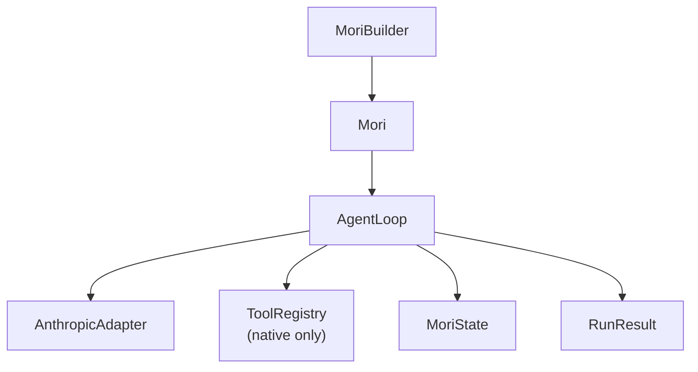

# v0.1 — "It Runs"

**Released:** 2026-04-19
**Specs added:** 01 (Core Types), 02 (Runtime), 05 (Tools — native only), 08 (Observability — stub)

## What Changed

- **`mori/types.py`** — the complete shared vocabulary: identifiers (`RunId`, `ToolId`, etc.),
  enums (`Phase`, `RunStatus`, `StepOutcome`), base models, message types, tool types,
  error hierarchy
- **`mori/runtime/`** — `AgentLoop` (plan → act → evaluate), `MoriState`, `RunResult`,
  `StepResult`
- **`mori/tools/`** — `ToolRegistry` (native Python callables only), `infer_schema()`
  (type annotation → JSON Schema)
- **`mori/model/`** — `ModelAdapter` protocol, `AnthropicAdapter` (full invoke + message
  conversion)
- **`mori/agent.py`** — `Mori` class, `MoriBuilder` fluent builder

## Why It Mattered

Before v0.1, there was nothing. The goal was the smallest possible working agent: given a
task, call Claude, execute any tool calls it requests, loop until done. Every subsequent
version builds on this foundation without breaking the builder API.

The decision to use **Pydantic v2 for all types** — not just for validation but as the
serialization layer — meant that every message, tool call, and result was JSON-serializable
from day one. This made observability (any event can be serialized) and testing (compare
models by value) natural to add later.

**Async-first** was the second foundation decision: the loop, tool invocations, and model
calls are all `async` even in v0.1. Synchronous tool functions are detected via
`asyncio.iscoroutinefunction` and called normally (no thread pool). This meant no rewrites
when MCP (requiring async HTTP) arrived in v0.2.

## Architecture at This Point

## Key Files Introduced

| File | Purpose |
|------|---------|
| `mori/types.py` | All shared types — the single source of truth |
| `mori/agent.py` | `Mori` + `MoriBuilder` — the public API |
| `mori/runtime/loop.py` | `AgentLoop` — plan/act/evaluate cycle |
| `mori/runtime/state.py` | `MoriState` — mutable run context |
| `mori/runtime/result.py` | `RunResult`, `StepResult` — immutable outputs |
| `mori/tools/registry.py` | `ToolRegistry` — native tool store + invoke |
| `mori/tools/schema.py` | `infer_schema()` — annotation → JSON Schema |
| `mori/model/base.py` | `ModelAdapter` protocol, `StreamChunk` |
| `mori/model/anthropic.py` | `AnthropicAdapter` — Claude via Anthropic SDK |

## Design Decisions Worth Noting

**Why not LangGraph for the loop?** Explicit choice to own the runtime. A framework adds
import overhead, opinionated abstractions, and version coupling. A 100-line async loop is
debuggable in 5 minutes.

**Why `NewType` for IDs?** `RunId`, `StepId`, `ToolId` are `NewType` wrappers over `str`.
At runtime they're plain strings, but mypy treats them as distinct types — so passing a
`ToolId` where a `RunId` is expected is a type error, not a silent bug.

**Why `model_config = {"frozen": False, "extra": "forbid"}` on `MoriModel`?** `extra =
"forbid"` catches field-name typos immediately at construction. `frozen = False` keeps
`MoriState` mutable across loop iterations. `ImmutableModel` (`frozen = True`) is used for
value objects like `TokenUsage` that should never change after creation.
