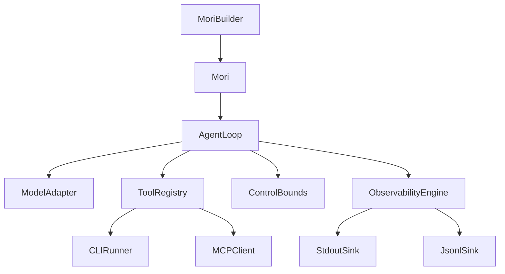

# v0.2 — "It Sees"

**Released:** 2026-04-25
**Specs added:** 05 (CLI + MCP protocols), 07 (ControlBounds extracted), 08 (Observability
engine + sinks)

## What Changed

- **`mori/observability/`** — `ObservabilityEngine` (buffered dispatch), full 13-event
  taxonomy, `StdoutSink` (real-time), `JsonlSink` (buffered)
- **`mori/control/`** — `ControlBounds`, `ControlConfig` extracted from inline loop logic
- **`mori/protocols/cli/`** — `CLIRunner` (anyio subprocess), `CLIToolConfig`, 4 argument
  format modes
- **`mori/protocols/mcp/`** — `MCPClient` (JSON-RPC 2.0 over HTTP), `SchemaCache` with TTL
- **`mori/tools/registry.py`** — extended with `register_cli()`, `register_mcp_server()`,
  per-tool metrics, result truncation
- **`mori/agent.py`** — added `.cli()`, `.mcp_server()`, `.sink()` builder methods

## Why It Mattered

A running agent without observability is a black box. v0.2 made every significant event —
step boundaries, tool calls, bound violations — a structured, serializable object. The stdout
sink gave immediate human-readable feedback; the JSONL sink gave machine-readable traces.

`ControlBounds` was extracted from inline `if step > max_steps:` checks into a first-class
module — configurable, testable in isolation, and observable (violations emit events).

CLI tools and MCP server integration expanded the tool surface from "Python functions only"
to "anything with a command-line interface or an MCP endpoint."

## Architecture at This Point

## Key Files Introduced

| File | Purpose |
|------|---------|
| `mori/observability/events.py` | Full event taxonomy + `EventSink` protocol + `ObservabilityConfig` |
| `mori/observability/engine.py` | Buffered dispatch, trace context, `get_run_summary()` |
| `mori/observability/sinks/stdout.py` | Color-formatted real-time console output |
| `mori/observability/sinks/jsonl.py` | Append-mode JSONL file writer |
| `mori/control/bounds.py` | `ControlBounds`, `ControlConfig`, `BoundCheckResult` |
| `mori/protocols/cli/runner.py` | `CLIRunner` — async subprocess via anyio |
| `mori/protocols/cli/args.py` | 4 argument formatting modes |
| `mori/protocols/mcp/client.py` | `MCPClient` — JSON-RPC 2.0 over HTTP/SSE |
| `mori/protocols/mcp/schema_cache.py` | `SchemaCache` — TTL-based tool schema caching |

## Design Decisions Worth Noting

**Real-time vs buffered sinks:** `StdoutSink` sets `realtime = True`; `JsonlSink` does not.
The engine uses this attribute to decide between `write()` immediately and buffering for
batch I/O. This allows interactive console output without penalizing file write throughput.

**Why anyio for CLIRunner?** `anyio.run_process()` + `anyio.fail_after()` gives timeout
support without blocking the event loop — which `subprocess.run()` would do in an async
context.

**Why JSON-RPC 2.0 for MCP?** The MCP spec uses JSON-RPC 2.0. Mori implements a minimal
client (no full JSON-RPC library dependency) that handles the protocol directly over HTTP
POST.
