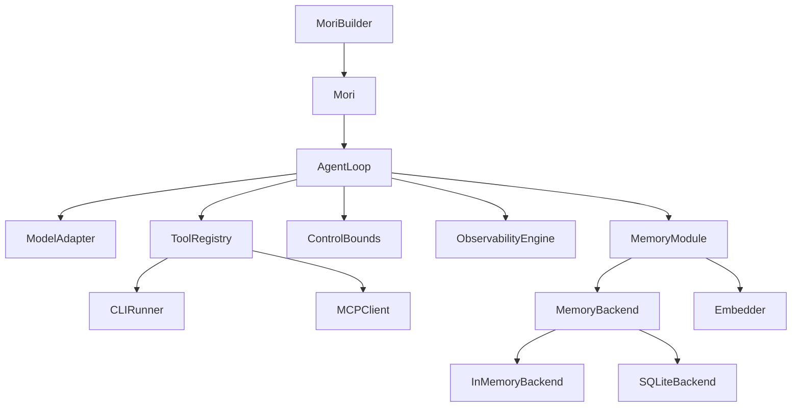

# v0.3 — "It Remembers"

**Released:** 2026-04-26
**Specs added:** 03 (Memory Module)

## What Changed

- **`mori/memory/`** — `MemoryModule`, `MemoryBackend` protocol, `InMemoryBackend` (numpy
  cosine), `SQLiteBackend`, `Embedder` protocol, `AnthropicEmbedder` (Voyage AI),
  `retrieve()` 4-stage pipeline
- **`mori/types.py`** — added `MemoryConfig`, `MemoryFilters`, `MemoryRecord`, `MemorySlice`,
  `MemoryLayer`, `ForgetPolicy`, `ForgetReport`, `MemoryStats`, `WriteReceipt`
- **`mori/runtime/state.py`** — added `memory_slice` field
- **`mori/runtime/loop.py`** — added `_phase_retrieve` (memory read) and `_phase_update`
  (working memory write); episodic write at run end
- **`mori/agent.py`** — added `.memory_backend()` builder method, `Mori.memory` property
- **`mori/observability/events.py`** — added `MemoryReadEvent`, `MemoryWriteEvent`

## Why It Mattered

Without memory, every agent run starts blind. v0.3 introduced persistent context as a
first-class concept — not as a hack on top of conversation history but as a structured,
queryable store with its own retrieval semantics.

The four-layer model separates concerns operationally: working memory is ephemeral (1-hour
TTL, session scratch), episodic memory is autobiographical (run history, no TTL), semantic
memory is curated facts, and personalized memory is user-specific patterns. Separate layers
make TTL enforcement, confidence pruning, and retrieval queries cheaper and more explicit
than a single unified store would be.

The 4-stage retrieval pipeline is the core innovation: query expansion → multi-layer fan-out
→ composite scoring (relevance × recency) → budget-aware truncation. The composite score
ensures the most contextually useful records reach the model within the token budget.

## Architecture at This Point

## Key Files Introduced

| File | Purpose |
|------|---------|
| `mori/memory/module.py` | `MemoryModule` — orchestrates read, write, promote, forget |
| `mori/memory/retrieval.py` | 4-stage retrieval pipeline |
| `mori/memory/embedder.py` | `Embedder` protocol + `AnthropicEmbedder` (Voyage AI) |
| `mori/memory/backends/base.py` | `MemoryBackend` protocol (8 methods) |
| `mori/memory/backends/inmemory.py` | Dict + numpy cosine similarity |
| `mori/memory/backends/sqlite.py` | sqlite3 + BLOB embeddings |

## Design Decisions Worth Noting

**Why four layers instead of one?** TTLs, retrieval characteristics, and confidence semantics
differ per layer. Working memory is ephemeral; semantic memory is curated. Mixing them
requires complex per-record filtering on every read. Separate layers make queries cheaper
and semantics explicit.

**Why Voyage AI for embeddings?** `voyage-3` (1024 dimensions) is Anthropic's embedding
partner. 1024-dimensional vectors are compact enough for in-process numpy cosine similarity
without a vector database for moderate record counts (up to ~50k records).

**Why recency_bias = 0.3?** 70% semantic relevance, 30% recency. Agents produce better
answers when recent context from the current session is weighted — but not so heavily that
stale-but-relevant semantic facts are buried.
