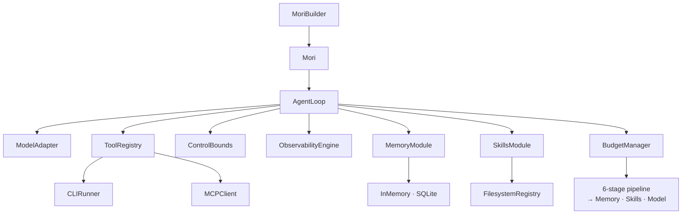

# v0.4 — "It Learns"

**Released:** 2026-04-29
**Specs added:** 04 (Skills Module), 09 (Context Budget Manager)

## What Changed

- **`mori/skills/`** — `SkillsModule`, `FilesystemRegistry`, `SkillManifest`, manifest
  parser with semver + name validation, `SkillCandidate`, `SkillPayload`, `BoundSkill`,
  `SkillHealthReport`
- **`mori/budget/`** — `BudgetManager`, `BudgetConfig`, 6-slot allocation, phase-specific
  overrides, 6-stage compaction pipeline
- **`mori/types.py`** — added `DisclosureLevel`
- **`mori/runtime/state.py`** — added `active_skill_payload`
- **`mori/runtime/loop.py`** — expanded `_phase_retrieve` (skill discovery + load); added
  `_pre_plan_compact` (budget rebalance + compaction); schema deferral in `_assemble_request`
- **`mori/agent.py`** — added `.skill_registry()`, `.budget()` builder methods; `Mori.skills`,
  `Mori.budget` properties
- **`mori/observability/events.py`** — added `SkillDiscoverEvent`, `SkillLoadEvent`,
  `BudgetRebalanceEvent`, `CompactionEvent`
- **`skills/`** — three example skill artifacts: `bug-fix`, `code-review`, `test-generation`
- **`pyproject.toml`** — added `pyyaml>=6.0`

## Why It Mattered

Skills solve a fundamental LLM reliability problem: without guidance, the model improvises.
Improvisation is inconsistent and fragile. A skill converts a recurring task pattern into a
guided composition — the model receives a structured approach alongside the task.

The budget manager solves context overflow. Without managed compaction, long-running agents
either fail with context overflow errors or truncate silently. The 6-stage pipeline degrades
gracefully — cheapest interventions first, most aggressive last — so the agent stays
operational as long as possible.

## Architecture at This Point

## Key Files Introduced

| File | Purpose |
|------|---------|
| `mori/skills/types.py` | `SkillManifest`, `SkillCandidate`, `SkillPayload`, `BoundSkill`, health types |
| `mori/skills/parser.py` | YAML manifest parser + SKILL.md loader with validation |
| `mori/skills/registry.py` | `FilesystemRegistry`, `CompositeRegistry`, `SkillRegistry` protocol |
| `mori/skills/module.py` | `SkillsModule` — discover, load, bind, health |
| `mori/budget/types.py` | `BudgetSlot`, `BudgetConfig`, `CompactionStage`, `CompactionReport` |
| `mori/budget/manager.py` | `BudgetManager` — allocation, rebalancing, compaction pipeline |

## Design Decisions Worth Noting

**Why progressive disclosure (abstract/summary/full)?** Skill content can be thousands of
tokens. Loading the full content every run wastes budget. The summary (50–500 tokens) gives
the model enough structure. If compaction triggers `_stage_skill_downgrade`, full skill
degrades to summary — reclaiming tokens without losing guidance.

**Why ordered compaction stages?** Each stage has different cost/reclaim tradeoffs.
`RESULT_TRIM` is free (already-received output). `SCHEMA_DEFER` saves tokens with zero
quality loss. `CONVERSATION_SUMMARIZE` is the most expensive (a model call). Running in
order means the agent never pays the cost of summarization if cheaper stages suffice.

**Why only one turn snipped per `TURN_SNIP` invocation?** Conservative by design. One snip
may suffice. If more is needed, later stages handle it. Aggressive multi-snip risks removing
context the model still needs for the current task.
