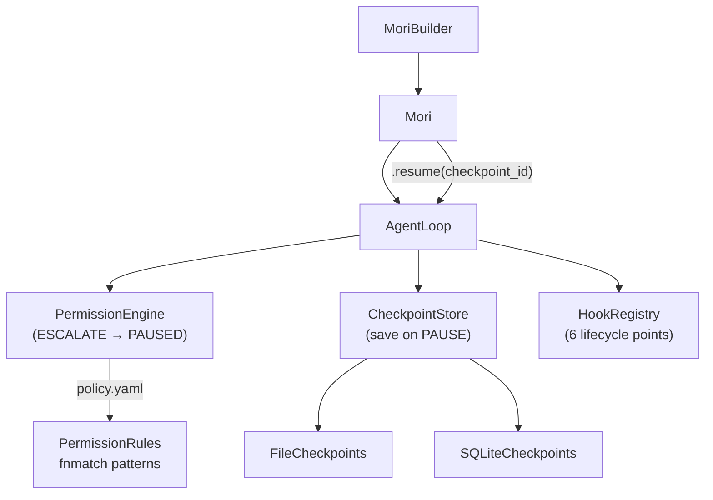

# v0.5 — "It's Governed"

!!! warning "In Progress"
    v0.5 is currently under active development. This page describes the planned
    implementation. See the implementation plan at `/docs/superpowers/plans/2026-05-01-mori-v05-its-governed.md`
    for details.

**Target release:** 2026-05
**Specs added:** 06 (Permission Engine), 10 (Plugins & Hooks — partial)

## What's Being Added

- **`mori/permission/`** — `PermissionEngine` with YAML policy files, Unix-style `rwx`
  permissions, fnmatch pattern matching for resources and identities, `ALLOW` / `DENY` /
  `ESCALATE` decisions
- **`mori/control/checkpoint.py`** — `Checkpoint` model, `CheckpointStore` protocol,
  `InMemoryCheckpoints`, `FileCheckpoints`, `SQLiteCheckpoints`
- **`mori/hooks/`** — `HookRegistry`, lifecycle hooks at 6 points: `run.start`,
  `run.end`, `tool.invoke.before`, `tool.invoke.after`, `model.request.before`,
  `model.response.after`
- **`AgentLoop.resume(checkpoint_id)`** — restore checkpoint, re-enter loop from
  paused state
- **`mori/agent.py`** — `.identity()`, `.policy_file()`, `.checkpointer()`, `.hook()`
  builder methods; `Mori.resume()`

## Why It Matters

The ESCALATE → PAUSE → approve → RESUME flow is the key governance primitive. An agent that
can pause on a sensitive tool call, persist its entire state, wait for a human decision, and
resume from exactly where it paused is a governed agent. Without this, every sensitive
operation requires either pre-approval (requiring prediction) or post-hoc review (too late).

Lifecycle hooks give operators visibility and control at key moments without modifying the
loop code. A hook on `tool.invoke.before` can implement rate limiting, compliance logging,
or circuit breaking transparently.

## Planned Architecture



## Governance Flow

```
agent.run(task)
    → loop calls permission.check(identity, tool_call)
        ALLOW   → execute tool normally
        DENY    → return ToolError to model
        ESCALATE → state.status = PAUSED
                   checkpointer.save(state) → checkpoint_id
                   return RunResult(status=PAUSED, checkpoint_id=...)

# Human reviews and approves
agent.resume(checkpoint_id)
    → checkpointer.load(checkpoint_id)
    → re-enter loop from paused state
    → continue normally
```

## Key Files Being Introduced

| File | Purpose |
|------|---------|
| `mori/permission/types.py` | `Identity`, `PermissionRule`, `ResourcePattern`, `PermissionResult` |
| `mori/permission/engine.py` | `PermissionEngine` — resolution algorithm, YAML loader |
| `mori/control/checkpoint.py` | `Checkpoint`, `CheckpointStore` protocol, 3 implementations |
| `mori/hooks/types.py` | `HookConfig`, `HookHandler`, `HookRegistration` |
| `mori/hooks/registry.py` | `HookRegistry` |
