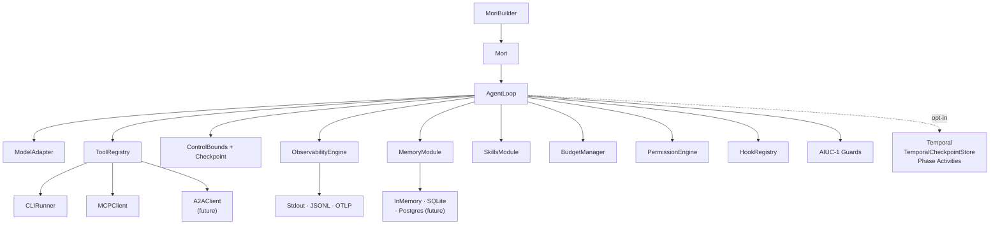

# V1 Roadmap

V1 is the complete, production-ready Mori — all 14 specs implemented, with a full governance
layer, AIUC-1 compliance primitives, a plugin/hook system, Temporal-backed durable execution,
and integration documentation.

## Remaining Specs

| Spec | Title | What it adds |
|------|-------|-------------|
| 06 | Permission Engine | ESCALATE → PAUSE → resume; YAML policy files; identity-based access *(v0.5, in progress)* |
| 10 | Plugins & Hooks | Lifecycle hooks at 6 points; LangGraph adapter; framework plugin API |
| 11 | Integration Patterns | Cross-module flows, startup sequences, multi-agent patterns, testing guide |
| 12 | AIUC-1 Compliance | Risk taxonomy, PII guard, IP guard, evidence exporter, `ComplianceSummary` |
| 13 | Pi Patterns | Tree sessions, context compaction patterns, AGENTS.md loader, steering, skills compat |
| 14 | Resilience & Temporal | Temporal-backed `CheckpointStore`, phase Activities, Signal-based PAUSE/RESUME, hook Activities |

## Complete V1 Module Set



## AIUC-1 Compliance Primitives (Spec 12)

- **`PIIGuard`** — detects and redacts PII in tool inputs/outputs before they enter memory
  or event streams
- **`IPGuard`** — detects potential IP-sensitive content (code, proprietary text)
- **`InputFilterGuard`** — validates inputs against a configurable allowlist/denylist
- **`OutputScopeGuard`** — verifies model outputs stay within the intended scope
- **`EvidenceExporter`** — produces a `ComplianceSummary` from a run's event stream: what
  happened, what data was accessed, what decisions were made

## Pi Patterns (Spec 13)

- **Tree sessions** — hierarchical agent sessions with parent/child context sharing
- **Context compaction patterns** — recipes for long-running agents that outlive their
  context window
- **AGENTS.md loader** — file format for encoding agent identity and capabilities, loaded at
  startup
- **Steering** — mid-run task redirection without restarting
- **Skills compatibility** — inter-agent skill version negotiation

## V1 Governance Flow

```
agent.run(task)
    → hooks: run.start fires
    → per step: hooks: model.request.before fires
    → per tool call:
        hooks: tool.invoke.before fires
        permission.check(identity, resource, permission)
            ALLOW   → execute
            DENY    → ToolError
            ESCALATE → state.status = PAUSED
                       checkpoint saved
                       RunResult(PAUSED) returned
        hooks: tool.invoke.after fires
    → AIUC-1 guards run on tool inputs/outputs
    → hooks: run.end fires

agent.resume(checkpoint_id)
    → checkpoint loaded
    → loop re-enters from paused state
```
