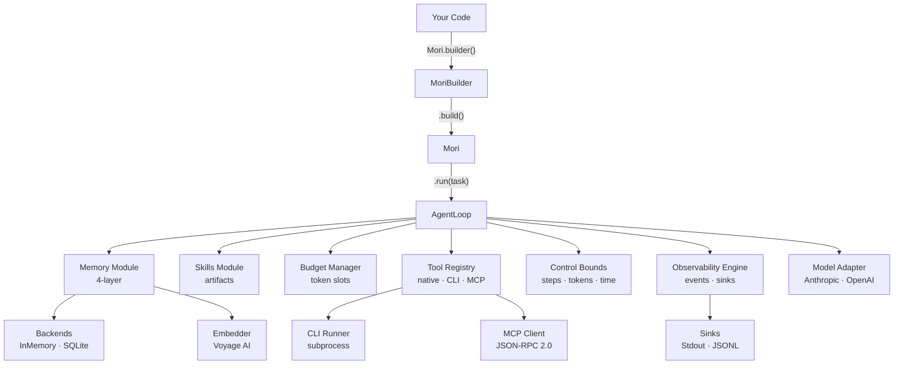

# Mori

**The cognitive environment for LLM agents.**

Mori (森, "forest") is a Python library for building governed LLM agent systems. It provides
a lightweight native runtime, four-layer memory, reusable skill artifacts, a managed protocol
registry, context budget management, and vendor-neutral observability — everything an agent
needs beyond the model itself.

Mori owns its runtime. It does not depend on LangGraph, LangChain, or any specific
orchestration framework. Those are supported as optional plugins. Mori's design principle:
frameworks are guests, not landlords.

## Design Philosophy

| Principle | Statement |
|-----------|-----------|
| **P1 — Own the runtime** | Mori's agent loop is a lightweight async state machine with no external orchestration dependency. Simple, debuggable, fast. |
| **P2 — Treat frameworks as plugins** | LangGraph, CrewAI, and other frameworks can run inside Mori, but Mori never depends on them. |
| **P3 — Representational transformation** | Every module changes the form of the task the model faces. Memory converts recall into recognition. Skills convert improvisation into guided composition. |
| **P4 — Minimal sufficiency** | Load only what reduces the model's cognitive burden for the current step. |
| **P5 — Governance by default** | Permissions, audit logging, and approval gates are structural components, not add-ons. |
| **P6 — Vendor-neutral** | Works with any LLM provider, any observability stack, any storage backend. |

## Architecture



## Modules

| Module | What it does | Page |
|--------|-------------|------|
| [Runtime](architecture/runtime.md) | Async agent loop — plan → act → evaluate with memory + skill context | [→](architecture/runtime.md) |
| [Memory](architecture/memory.md) | Four-layer persistent memory (working / episodic / semantic / personalized) with vector retrieval | [→](architecture/memory.md) |
| [Skills](architecture/skills.md) | Filesystem-loaded task guides with progressive disclosure (abstract → summary → full) | [→](architecture/skills.md) |
| [Budget Manager](architecture/budget.md) | Per-slot context token tracking and 6-stage compaction pipeline | [→](architecture/budget.md) |
| [Observability](architecture/observability.md) | Structured event emission to pluggable sinks (stdout, JSONL) | [→](architecture/observability.md) |
| [Tools & Protocols](architecture/tools-and-protocols.md) | Native Python callables, CLI subprocess tools, MCP server tools | [→](architecture/tools-and-protocols.md) |
| [Control](architecture/control.md) | Resource bounds (max steps, tokens, timeouts) and retry logic | [→](architecture/control.md) |
| [Model Adapters](architecture/model-adapters.md) | Provider-neutral LLM interface; Anthropic Claude adapter included | [→](architecture/model-adapters.md) |

## Quickstart

```python
import asyncio
from mori import Mori

async def main():
    agent = (
        Mori.builder()
        .model("anthropic", model="claude-sonnet-4-20250514")
        .tool(lambda city: f"{city}: 72°F", description="Get weather", name="get_weather")
        .memory_backend("inmemory")
        .skill_registry("./skills")
        .sink("stdout")
        .budget(total_context_tokens=200_000)
        .build()
    )
    result = await agent.run("What's the weather in Paris?")
    print(result.final_output)
    await agent.close()

asyncio.run(main())
```

## Version History

| Version | Codename | What it added |
|---------|----------|---------------|
| [v0.1](history/v01-it-runs.md) | It Runs | Foundation — types, loop, tool registry, Anthropic adapter |
| [v0.2](history/v02-it-sees.md) | It Sees | Observability, control bounds, CLI tools, MCP protocol |
| [v0.3](history/v03-it-remembers.md) | It Remembers | Four-layer memory, retrieval pipeline, SQLite backend |
| [v0.4](history/v04-it-learns.md) | It Learns | Skills module, budget manager, 6-stage compaction |
| [v0.5](history/v05-its-governed.md) | It's Governed | Permission engine, checkpoints, lifecycle hooks *(in progress)* |
| [V1 Roadmap](history/v1-roadmap.md) | — | Full spec coverage: compliance, plugins, integration patterns |
